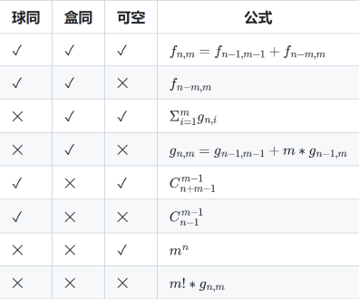

# ACM常用算法模板

<!-- TOC -->

- [ACM常用算法模板](#acm%E5%B8%B8%E7%94%A8%E7%AE%97%E6%B3%95%E6%A8%A1%E6%9D%BF)
    - [数据结构](#%E6%95%B0%E6%8D%AE%E7%BB%93%E6%9E%84)
        - [并查集](#%E5%B9%B6%E6%9F%A5%E9%9B%86)
        - [树状数组](#%E6%A0%91%E7%8A%B6%E6%95%B0%E7%BB%84)
        - [线段树](#%E7%BA%BF%E6%AE%B5%E6%A0%91)
        - [可持久化线段树](#%E5%8F%AF%E6%8C%81%E4%B9%85%E5%8C%96%E7%BA%BF%E6%AE%B5%E6%A0%91)
        - [st 表](#st-%E8%A1%A8)
    - [图论](#%E5%9B%BE%E8%AE%BA)
        - [最短路](#%E6%9C%80%E7%9F%AD%E8%B7%AF)
        - [树上问题](#%E6%A0%91%E4%B8%8A%E9%97%AE%E9%A2%98)
            - [最近公公祖先](#%E6%9C%80%E8%BF%91%E5%85%AC%E5%85%AC%E7%A5%96%E5%85%88)
            - [树链剖分](#%E6%A0%91%E9%93%BE%E5%89%96%E5%88%86)
        - [强连通分量](#%E5%BC%BA%E8%BF%9E%E9%80%9A%E5%88%86%E9%87%8F)
        - [拓扑排序](#%E6%8B%93%E6%89%91%E6%8E%92%E5%BA%8F)
    - [字符串](#%E5%AD%97%E7%AC%A6%E4%B8%B2)
        - [kmp](#kmp)
        - [哈希](#%E5%93%88%E5%B8%8C)
        - [manacher](#manacher)
    - [数学](#%E6%95%B0%E5%AD%A6)
        - [扩展欧几里得](#%E6%89%A9%E5%B1%95%E6%AC%A7%E5%87%A0%E9%87%8C%E5%BE%97)
        - [线性筛法](#%E7%BA%BF%E6%80%A7%E7%AD%9B%E6%B3%95)
        - [分解质因数](#%E5%88%86%E8%A7%A3%E8%B4%A8%E5%9B%A0%E6%95%B0)
        - [组合数](#%E7%BB%84%E5%90%88%E6%95%B0)
        - [盒子与球](#%E7%9B%92%E5%AD%90%E4%B8%8E%E7%90%83)
        - [线性基](#%E7%BA%BF%E6%80%A7%E5%9F%BA)
        - [矩阵快速幂](#%E7%9F%A9%E9%98%B5%E5%BF%AB%E9%80%9F%E5%B9%82)
    - [计算几何](#%E8%AE%A1%E7%AE%97%E5%87%A0%E4%BD%95)
        - [扫描线](#%E6%89%AB%E6%8F%8F%E7%BA%BF)
    - [杂项](#%E6%9D%82%E9%A1%B9)
        - [高精度](#%E9%AB%98%E7%B2%BE%E5%BA%A6)
        - [模运算](#%E6%A8%A1%E8%BF%90%E7%AE%97)
        - [分数](#%E5%88%86%E6%95%B0)
        - [表达式求值](#%E8%A1%A8%E8%BE%BE%E5%BC%8F%E6%B1%82%E5%80%BC)
        - [日期](#%E6%97%A5%E6%9C%9F)
        - [对拍](#%E5%AF%B9%E6%8B%8D)
        - [编译常用选项](#%E7%BC%96%E8%AF%91%E5%B8%B8%E7%94%A8%E9%80%89%E9%A1%B9)
        - [开栈](#%E5%BC%80%E6%A0%88)

<!-- /TOC -->

## 数据结构

### 并查集

```cpp
struct dsu {
    int n;
    vector<int> fa;
    dsu(int _n) : n(_n) {
        fa.resize(n + 1);
        iota(fa.begin(), fa.end(), 0);
    }
    int find(int x) { return x == fa[x] ? x : fa[x] = find(fa[x]); }
    int merge(int x, int y) {
        int fax = find(x), fay = find(y);
        if (fax == fay) return 0;      // 一个集合
        return fa[find(x)] = find(y);  // 合并到哪个集合了
    }
};
```

### 树状数组

一维

```cpp
template <class T>
struct Fenwick_tree {
    Fenwick_tree(int n) : n(n), tree(n + 1, 0) {}
    T query(int l, int r) {
        auto query = [&](int pos) {
            T res = 0;
            while (pos) {
                res += tree[pos];
                pos -= lowbit(pos);
            }
            return res;
        };
        return query(r) - query(l - 1);
    }
    void update(int pos, T num) {
        while (pos <= n) {
            tree[pos] += num;
            pos += lowbit(pos);
        }
    }
private:
    int n;
    vector<T> tree;
};
```

二维

```cpp
template <class T>
struct Fenwick_tree_2 {
    Fenwick_tree_2(int n, int m) : n(n), m(m), tree(n + 1, vector<T>(m + 1)) {}
    T query(int l1, int r1, int l2, int r2) {
        auto query = [&](int l, int r) {
            T res = 0;
            for (int i = l; i; i -= lowbit(i))
                for (int j = r; j; j -= lowbit(j)) res += tree[i][j];
            return res;
        };
        return query(l2, r2) - query(l2, r1 - 1) - query(l1 - 1, r2) +
               query(l1 - 1, r1 - 1);
    }
    void update(int x, int y, T num) {
        for (int i = x; i <= n; i += lowbit(i))
            for (int j = y; j <= m; j += lowbit(j)) tree[i][j] += num;
    }
private:
    int n, m;
    vector<vector<T>> tree;
};
```

三维

```cpp
template <class T>
struct Fenwick_tree_3 {
    Fenwick_tree_3(int n, int m, int k)
        : n(n),
          m(m),
          k(k),
          tree(n + 1, vector<vector<T>>(m + 1, vector<T>(k + 1))) {}
    T query(int a, int b, int c, int d, int e, int f) {
        auto query = [&](int x, int y, int z) {
            T res = 0;
            for (int i = x; i; i -= lowbit(i))
                for (int j = y; j; j -= lowbit(j))
                    for (int p = z; p; p -= lowbit(p)) res += tree[i][j][p];
            return res;
        };
        T res = query(d, e, f);
        res -= query(a - 1, e, f) + query(d, b - 1, f) + query(d, e, c - 1);
        res += query(a - 1, b - 1, f) + query(a - 1, e, c - 1) +
               query(d, b - 1, c - 1);
        res -= query(a - 1, b - 1, c - 1);
        return res;
    }
    void update(int x, int y, int z, T num) {
        for (int i = x; i <= n; i += lowbit(i))
            for (int j = y; j <= m; j += lowbit(j))
                for (int p = z; p <= k; p += lowbit(p)) tree[i][j][p] += num;
    }
private:
    int n, m, k;
    vector<vector<vector<T>>> tree;
};
```

### 线段树

```cpp
template <class Data, class Num>
struct Segment_Tree {
    inline void update(int l, int r, Num x) { update(1, l, r, x); }
    inline Data query(int l, int r) { return query(1, l, r); }
    Segment_Tree(vector<Data>& a) {
        n = a.size();
        tree.assign(n * 4 + 1, {});
        build(a, 1, 1, n);
    }
private:
    int n;
    struct Tree {
        int l, r;
        Data data;
    };
    vector<Tree> tree;
    inline void pushup(int pos) {
        tree[pos].data = tree[pos << 1].data + tree[pos << 1 | 1].data;
    }
    inline void pushdown(int pos) {
        tree[pos << 1].data = tree[pos << 1].data + tree[pos].data.lazytag;
        tree[pos << 1 | 1].data =
            tree[pos << 1 | 1].data + tree[pos].data.lazytag;
        tree[pos].data.lazytag = Num::zero();
    }
    void build(vector<Data>& a, int pos, int l, int r) {
        tree[pos].l = l;
        tree[pos].r = r;
        if (l == r) {
            tree[pos].data = a[l - 1];
            return;
        }
        int mid = (tree[pos].l + tree[pos].r) >> 1;
        build(a, pos << 1, l, mid);
        build(a, pos << 1 | 1, mid + 1, r);
        pushup(pos);
    }
    void update(int pos, int& l, int& r, Num& x) {
        if (l > tree[pos].r || r < tree[pos].l) return;
        if (l <= tree[pos].l && tree[pos].r <= r) {
            tree[pos].data = tree[pos].data + x;
            return;
        }
        pushdown(pos);
        update(pos << 1, l, r, x);
        update(pos << 1 | 1, l, r, x);
        pushup(pos);
    }
    Data query(int pos, int& l, int& r) {
        if (l > tree[pos].r || r < tree[pos].l) return Data::zero();
        if (l <= tree[pos].l && tree[pos].r <= r) return tree[pos].data;
        pushdown(pos);
        return query(pos << 1, l, r) + query(pos << 1 | 1, l, r);
    }
};
struct Num {
    ll add;
    inline static Num zero() { return {0}; }
    inline Num operator+(Num b) { return {add + b.add}; }
};
struct Data {
    ll sum, len;
    Num lazytag;
    inline static Data zero() { return {0, 0, Num::zero()}; }
    inline Data operator+(Num b) {
        return {sum + len * b.add, len, lazytag + b};
    }
    inline Data operator+(Data b) {
        return {sum + b.sum, len + b.len, Num::zero()};
    }
};
```

### 可持久化线段树

```cpp
constexpr int MAXN = 200000;
vector<int> root(MAXN << 5);
struct Persistent_seg {
    int n;
    struct Data {
        int ls, rs;
        int val;
    };
    vector<Data> tree;
    Persistent_seg(int n, vector<int>& a) : n(n) { root[0] = build(1, n, a); }
    int build(int l, int r, vector<int>& a) {
        if (l == r) {
            tree.push_back({0, 0, a[l]});
            return tree.size() - 1;
        }
        int mid = l + r >> 1;
        int ls = build(l, mid, a), rs = build(mid + 1, r, a);
        tree.push_back({ls, rs, tree[ls].val + tree[rs].val});
        return tree.size() - 1;
    }
    int update(int rt, const int& idx, const int& val, int l, int r) {
        if (l == r) {
            tree.push_back({0, 0, tree[rt].val + val});
            return tree.size() - 1;
        }
        int mid = l + r >> 1, ls = tree[rt].ls, rs = tree[rt].rs;
        if (idx <= mid) ls = update(ls, idx, val, l, mid);
        else rs = update(rs, idx, val, mid + 1, r);
        tree.push_back({ls, rs, tree[ls].val + tree[rs].val});
        return tree.size() - 1;
    }
    int query(int rt1, int rt2, int k, int l, int r) {
        if (l == r) return l;
        int mid = l + r >> 1;
        int lcnt = tree[tree[rt2].ls].val - tree[tree[rt1].ls].val;
        if (k <= lcnt) return query(tree[rt1].ls, tree[rt2].ls, k, l, mid);
        else return query(tree[rt1].rs, tree[rt2].rs, k - lcnt, mid + 1, r);
    }
};
```

### st 表

```cpp
auto lg = []() {
    array<int, 10000001> lg;
    lg[1] = 0;
    for (int i = 2; i <= 10000000; i++) lg[i] = lg[i >> 1] + 1;
    return lg;
}();
template <typename T>
struct st {
    int n;
    vector<vector<T>> a;
    st(vector<T>& _a) : n(_a.size()) {
        a.assign(lg[n] + 1, vector<int>(n));
        for (int i = 0; i < n; i++) a[0][i] = _a[i];
        for (int j = 1; j <= lg[n]; j++)
            for (int i = 0; i + (1 << j) - 1 < n; i++)
                a[j][i] = max(a[j - 1][i], a[j - 1][i + (1 << (j - 1))]);
    }
    T query(int l, int r) {
        int k = lg[r - l + 1];
        return max(a[k][l], a[k][r - (1 << k) + 1]);
    }
};
```

## 图论

存图

```cpp
struct Graph {
    int n;
    struct Edge {
        int to, w;
    };
    vector<vector<Edge>> graph;
    Graph(int _n) {
        n = _n;
        graph.assign(n + 1, vector<Edge>());
    };
    void add(int u, int v, int w) { graph[u].push_back({v, w}); }
};
```

### 最短路

dijkstra

```cpp
void dij(Graph& graph, vector<int>& dis, int t) {
    vector<int> visit(graph.n + 1, 0);
    priority_queue<pair<int, int>> que;
    dis[t] = 0;
    que.emplace(0, t);
    while (!que.empty()) {
        int u = que.top().second;
        que.pop();
        if (visit[u]) continue;
        visit[u] = 1;
        for (auto& [to, w] : graph.graph[u]) {
            if (dis[to] > dis[u] + w) {
                dis[to] = dis[u] + w;
                que.emplace(-dis[to], to);
            }
        }
    }
}
```

### 树上问题

#### 最近公公祖先

倍增法

```cpp
vector<int> dep;
vector<array<int, 21>> fa;
dep.assign(n + 1, 0);
fa.assign(n + 1, array<int, 21>{});
void binary_jump(int root) {
    function<void(int)> dfs = [&](int t) {
        dep[t] = dep[fa[t][0]] + 1;
        for (auto& [to] : graph[t]) {
            if (to == fa[t][0]) continue;
            fa[to][0] = t;
            dfs(to);
        }
    };
    dfs(root);
    for (int j = 1; j <= 20; j++)
        for (int i = 1; i <= n; i++) fa[i][j] = fa[fa[i][j - 1]][j - 1];
}
int lca(int x, int y) {
    if (dep[x] < dep[y]) swap(x, y);
    for (int i = 20; i >= 0; i--)
        if (dep[fa[x][i]] >= dep[y]) x = fa[x][i];
    if (x == y) return x;
    for (int i = 20; i >= 0; i--) {
        if (fa[x][i] != fa[y][i]) {
            x = fa[x][i];
            y = fa[y][i];
        }
    }
    return fa[x][0];
}
```

树剖

```cpp
int lca(int x, int y) {
    while (top[x] != top[y]) {
        if (dep[top[x]] < dep[top[y]]) swap(x, y);
        x = fa[top[x]];
    }
    if (dep[x] < dep[y]) swap(x, y);
    return y;
}
```

#### 树链剖分

```cpp
vector<int> fa, siz, dep, son, dfn, rnk, top;
fa.assign(n + 1, 0);
siz.assign(n + 1, 0);
dep.assign(n + 1, 0);
son.assign(n + 1, 0);
dfn.assign(n + 1, 0);
rnk.assign(n + 1, 0);
top.assign(n + 1, 0);
void hld(int root) {
    function<void(int)> dfs1 = [&](int t) {
        dep[t] = dep[fa[t]] + 1;
        siz[t] = 1;
        for (auto& [to, w] : graph[t]) {
            if (to == fa[t]) continue;
            fa[to] = t;
            dfs1(to);
            if (siz[son[t]] < siz[to]) son[t] = to;
            siz[t] += siz[to];
        }
    };
    dfs1(root);
    int dfn_tail = 0;
    for (int i = 1; i <= n; i++) top[i] = i;
    function<void(int)> dfs2 = [&](int t) {
        dfn[t] = ++dfn_tail;
        rnk[dfn_tail] = t;
        if (!son[t]) return;
        top[son[t]] = top[t];
        dfs2(son[t]);
        for (auto& [to, w] : graph[t]) {
            if (to == fa[t] || to == son[t]) continue;
            dfs2(to);
        }
    };
    dfs2(root);
}
```

### 强连通分量

```cpp
void tarjan(Graph& g1, Graph& g2) {
    int dfn_tail = 0, cnt = 0;
    vector<int> dfn(g1.n + 1, 0), low(g1.n + 1, 0), exist(g1.n + 1, 0),
        belong(g1.n + 1, 0);
    stack<int> sta;
    function<void(int)> dfs = [&](int t) {
        dfn[t] = low[t] = ++dfn_tail;
        sta.push(t);
        exist[t] = 1;
        for (auto& [to] : g1.graph[t])
            if (!dfn[to]) {
                dfs(to);
                low[t] = min(low[t], low[to]);
            } else if (exist[to]) low[t] = min(low[t], dfn[to]);
        if (dfn[t] == low[t]) {
            cnt++;
            while (int temp = sta.top()) {
                belong[temp] = cnt;
                exist[temp] = 0;
                sta.pop();
                if (temp == t) break;
            }
        }
    };
    for (int i = 1; i <= g1.n; i++)
        if (!dfn[i]) dfs(i);
    g2 = Graph(cnt);
    for (int i = 1; i <= g1.n; i++) g2.w[belong[i]] += g1.w[i];
    for (int i = 1; i <= g1.n; i++)
        for (auto& [to] : g1.graph[i])
            if (belong[i] != belong[to]) g2.add(belong[i], belong[to]);
}
```

### 拓扑排序

```cpp
void toposort(Graph& g, vector<int>& dis) {
    vector<int> in(g.n + 1, 0);
    for (int i = 1; i <= g.n; i++)
        for (auto& [to] : g.graph[i]) in[to]++;
    queue<int> que;
    for (int i = 1; i <= g.n; i++)
        if (!in[i]) {
            que.push(i);
            dis[i] = g.w[i];  // dp
        }
    while (!que.empty()) {
        int u = que.front();
        que.pop();
        for (auto& [to] : g.graph[u]) {
            in[to]--;
            dis[to] = max(dis[to], dis[u] + g.w[to]);  // dp
            if (!in[to]) que.push(to);
        }
    }
}
```

## 字符串

### kmp

```cpp
auto kmp(string& s) {
    vector next(s.size(), -1);
    for (int i = 1, j = -1; i < s.size(); i++) {
        while (j >= 0 && s[i] != s[j + 1]) j = next[j];
        if (s[i] == s[j + 1]) j++;
        next[i] = j;
    }
    // next 意为长度
    for (auto& i : next) i++;
    return next;
}
```

### 哈希

```cpp
constexpr int N = 2e6;
constexpr ll mod[2] = {2000000011, 2000000033}, base[2] = {20011, 20033};
vector<array<ll, 2>> pow_base(N);

pow_base[0][0] = pow_base[0][1] = 1;
for (int i = 1; i < N; i++) {
    pow_base[i][0] = pow_base[i - 1][0] * base[0] % mod[0];
    pow_base[i][1] = pow_base[i - 1][1] * base[1] % mod[1];
}

struct Hash {
    int size;
    vector<array<ll, 2>> hash;
    Hash() {}
    Hash(const string& s) {
        size = s.size();
        hash.resize(size);
        hash[0][0] = hash[0][1] = s[0];
        for (int i = 1; i < size; i++) {
            hash[i][0] = (hash[i - 1][0] * base[0] + s[i]) % mod[0];
            hash[i][1] = (hash[i - 1][1] * base[1] + s[i]) % mod[1];
        }
    }
    array<ll, 2> operator[](const array<int, 2>& range) const {
        int l = range[0], r = range[1];
        if (l == 0) return hash[r];
        auto single_hash = [&](bool flag) {
            return (hash[r][flag] -
                    hash[l - 1][flag] * pow_base[r - l + 1][flag] % mod[flag] +
                    mod[flag]) %
                   mod[flag];
        };
        return {single_hash(0), single_hash(1)};
    }
};
```

### manacher

```cpp
void manacher(const string& _s, vector<int>& r) {
    string s(_s.size() * 2 + 1, '$');
    for (int i = 0; i < _s.size(); i++) s[2 * i + 1] = _s[i];
    r.resize(_s.size() * 2 + 1);
    for (int i = 0, maxr = 0, mid = 0; i < s.size(); i++) {
        if (i < maxr) r[i] = min(r[mid * 2 - i], maxr - i);
        while (i - r[i] - 1 >= 0 && i + r[i] + 1 < s.size() &&
               s[i - r[i] - 1] == s[i + r[i] + 1])
            ++r[i];
        if (i + r[i] > maxr) maxr = i + r[i], mid = i;
    }
}
```

## 数学

### 扩展欧几里得

$x=x+k*dx,y=y-k*dy$

若要求 $x>0$，$k>-\frac{x}{dx}\Rightarrow k\ge\lceil \frac{-x+1}{dx}\rceil$

若要求 $x\ge0$，$k>-\frac{x}{dx}\Rightarrow k\ge\lceil -\frac{x}{dx}\rceil$

若要求 $y>0$，$k<\frac{y}{dy}\Rightarrow k\le\lfloor \frac{y-1}{dy}\rfloor$

若要求 $y\ge0$，$k<\frac{y}{dy}\Rightarrow k\le\lceil \frac{y}{dy}\rceil$


```cpp
int __exgcd(int a, int b, int& x, int& y) {
    if (!b) {
        x = 1;
        y = 0;
        return a;
    }
    int d = __exgcd(b, a % b, x, y);
    int t = x;
    x = y;
    y = t - (a / b) * y;
    return d;
}
array<int, 2> exgcd(int a, int b, int c) {
    int x, y;
    int gcd_a_b = __exgcd(a, b, x, y);
    if (c % gcd_a_b) return {INT_MAX, INT_MAX};
    x *= c / gcd_a_b;
    y *= c / gcd_a_b;
    int dx = b / gcd_a_b;
    int dy = a / gcd_a_b;
    // x = x + k* dx y = y - k* dy
    // 调整为 x >=0 的最小解
    int k = ceil(-1.0 * x / dx);
    x += k * dx;
    y -= k * dy;
    return {x, y};
}
```

### 线性筛法

```cpp
auto [min_prime, prime] = []() {
    constexpr int N = 10000000;
    vector<int> min_prime(N + 1, 0), prime;
    for (int i = 2; i <= N; i++) {
        if (min_prime[i] == 0) {
            min_prime[i] = i;
            prime.push_back(i);
        }
        for (auto& j : prime) {
            if (j > min_prime[i] || j > N / i) break;
            min_prime[j * i] = j;
        }
    }
    return tuple{min_prime, prime};
}();
```

### 分解质因数

```cpp
auto num_prime(int num) {
    vector<array<int, 2>> res;
    for (auto& i : prime) {
        if (i > num / i) break;
        if (num % i == 0) {
            res.push_back({i, 0});
            while (num % i == 0) {
                num /= i;
                res.back()[1]++;
            }
        }
    }
    if (num > 1) res.push_back({num, 1});
    return res;
}
```

### 组合数

```cpp
array<modint, N + 1> fac, ifac;
fac[0] = ifac[0] = 1;
for (int i = 1; i <= N; i++) {
    fac[i] = fac[i - 1] * i;
    ifac[i] = fac[i].inv();
}
modint C(int n, int m) {
    if (n < m) return 0;
    if (m == 0) return 1;
    if (n <= mod) return fac[n] * ifac[m] * ifac[n - m];
    // n >= mod 时需要这个
    return C(n % mod, m % mod) * C(n / mod, m / mod);
}
```

### 盒子与球

$n$ 个球，$m$ 个盒



### 线性基

```cpp
// 线性基
struct basis {
    array<unsigned ll, 64> p{};

    // 将x插入此线性基中
    void insert(unsigned ll x) {
        for (int i = 63; i >= 0; i--) {
            if ((x >> i) & 1) {
                if (p[i]) x ^= p[i];
                else {
                    p[i] = x;
                    break;
                }
            }
        }
    }

    // 将另一个线性基插入此线性基中
    void insert(basis other) {
        for (int i = 0; i <= 63; i++) {
            if (!other.p[i]) continue;
            insert(other.p[i]);
        }
    }

    // 最大异或值
    unsigned ll max_basis() {
        unsigned ll res = 0;
        for (int i = 63; i >= 0; i--)
            if ((res ^ p[i]) > res) res ^= p[i];
        return res;
    }
};
```

### 矩阵快速幂

```cpp
constexpr ll mod = 2147493647;
struct Mat {
    int n, m;
    vector<vector<ll>> mat;
    Mat(int n, int m) : n(n), m(n), mat(n, vector<ll>(m, 0)) {}
    Mat(vector<vector<ll>> mat) : n(mat.size()), m(mat[0].size()), mat(mat) {}
    Mat operator*(const Mat& other) {
        assert(m == other.n);
        Mat res(n, other.m);
        for (int i = 0; i < res.n; i++)
            for (int j = 0; j < res.m; j++)
                for (int k = 0; k < m; k++)
                    res.mat[i][j] =
                        (res.mat[i][j] + mat[i][k] * other.mat[k][j] % mod) %
                        mod;
        return res;
    }
};
Mat ksm(Mat a, ll b) {
    assert(a.n == a.m);
    Mat res(a.n, a.m);
    for (int i = 0; i < res.n; i++) res.mat[i][i] = 1;
    while (b) {
        if (b & 1) res = res * a;
        b >>= 1;
        a = a * a;
    }
    return res;
}
```

## 计算几何

```cpp
double eps = 1e-8;
const double PI = acos(-1);
using T = ll;

template <typename T>
int cmp(T a, T b) {
    return a != b ? a < b ? -1 : 1 : 0;
}

int cmp(double a, double b) {
    double c = a - b;
    if (abs(c) < eps) return 0;
    return c < 0 ? -1 : 1;
}

// 向量
struct vec {
    T x, y;
    vec(T _x = 0, T _y = 0) : x(_x), y(_y) {}

    // 模
    double length() const { return sqrt(x * x + y * y); }

    // 与x轴正方向的夹角
    double angle() const {
        double angle = atan2(y, x);
        if (angle < 0) angle += 2 * PI;
        return angle;
    }

    // 逆时针旋转
    vec &rotate(const double &theta) {
        double tmp = x;
        x = x * cos(theta) - y * sin(theta);
        y = y * cos(theta) + tmp * sin(theta);
        return *this;
    }

    bool operator==(const vec &other) const {
        return !cmp(x, other.x) && !cmp(y, other.y);
    }
    bool operator<(const vec &other) const {
        int tmp = cmp(angle(), other.angle());
        if (tmp) return tmp == -1 ? 0 : 1;
        tmp = cmp(x, other.x);
        return tmp == -1 ? 0 : 1;
    }

    vec operator+(const vec &other) const { return {x + other.x, y + other.y}; }
    vec operator-() const { return {-x, -y}; }
    vec operator-(const vec &other) const { return -other + (*this); }
    vec operator*(const T &other) const { return {x * other, y * other}; }
    vec operator/(const T &other) const { return {x / other, y / other}; }
    T operator*(const vec &other) const { return x * other.x + y * other.y; }

    // 叉积 结果大于0，a到b为逆时针，小于0，a到b顺时针,
    // 等于0共线，可能同向或反向，结果绝对值表示 a b 形成的平行四边行的面积
    T operator^(const vec &other) const { return x * other.y - y * other.x; }

    friend istream &operator>>(istream &input, vec &data) {
        input >> data.x >> data.y;
        return input;
    }
    friend ostream &operator<<(ostream &output, const vec &data) {
        output << fixed << setprecision(6);
        output << data.x << " " << data.y;
        return output;
    }
};

T cross(const vec &a, const vec &b, const vec &c) { return (a - c) ^ (b - c); }

// 两点间的距离
T distance(const vec &a, const vec &b) {
    return sqrt((a.x - b.x) * (a.x - b.x) + (a.y - b.y) * (a.y - b.y));
}

// 两向量夹角
double angle(const vec &a, const vec &b) {
    double theta = abs(a.angle() - b.angle());
    if (theta > PI) theta = 2 * PI - theta;
    return theta;
}

// 判断点是否在凸包内
bool in_polygon(const vec &a, vector<vec> &p) {
    int n = p.size();
    if (n == 1) return a == p[0];
    if (cross(a, p[1], p[0]) > 0 || cross(p.back(), a, p[0]) > 0) return 0;
    auto cmp = [&p](vec &x, const vec &y) { return ((x - p[0]) ^ y) >= 0; };
    int i = lower_bound(p.begin() + 2, p.end(), a - p[0], cmp) - p.begin() - 1;
    return cross(p[(i + 1) % n], a, p[i]) >= 0;
}

// 多边形的面积
double polygon_area(vector<vec> &p) {
    T area = 0;
    for (int i = 1; i < p.size(); i++) area += p[i - 1] ^ p[i];
    area += p.back() ^ p[0];
    return abs(area / 2.0);
}

// 多边形的周长
double polygon_length(vector<vec> &p) {
    double length = 0;
    for (int i = 1; i < p.size(); i++) length += (p[i - 1] - p[i]).length();
    length += (p.back() - p[0]).length();
    return length;
}

// 以整点为顶点的线段上的整点个数
T count(const vec &a, const vec &b) {
    vec c = a - b;
    return gcd(abs(c.x), abs(c.y)) + 1;
}

// 以整点为顶点的多边形边上整点个数
T count(vector<vec> &p) {
    T cnt = 0;
    for (int i = 1; i < p.size(); i++) cnt += count(p[i - 1], p[i]);
    cnt += count(p.back(), p[0]);
    return cnt - p.size();
}

// 凸包直径的两个端点
auto polygon_dia(vector<vec> &p) {
    int n = p.size();
    array<vec, 2> res{};
    if (n == 1) return res;
    if (n == 2) return res = {p[0], p[1]};
    T mx = 0;
    for (int i = 0, j = 2; i < n; i++) {
        while (abs(cross(p[i], p[(i + 1) % n], p[j])) <=
               abs(cross(p[i], p[(i + 1) % n], p[(j + 1) % n])))
            j = (j + 1) % n;
        if (T tmp = distance(p[i], p[j]); tmp > mx) {
            mx = tmp;
            res = {p[i], p[j]};
        }
        if (T tmp = distance(p[(i + 1) % n], p[j]); tmp > mx) {
            mx = tmp;
            res = {p[(i + 1) % n], p[j]};
        }
    }
    return res;
}

// 凸包
auto convex_hull(vector<vec> &p) {
    sort(p.begin(), p.end(), [](vec &a, vec &b) {
        int tmp = cmp(a.x, b.x);
        if (tmp) return tmp == -1 ? 0 : 1;
        tmp = cmp(a.y, b.y);
        return tmp == -1 ? 0 : 1;
    });
    int n = p.size();
    vector sta(n + 1, 0);
    vector v(n, false);
    int tp = -1;
    sta[++tp] = 0;
    auto update = [&](int lim, int i) {
        while (tp > lim &&
               ((p[sta[tp]] - p[sta[tp - 1]]) ^ (p[i] - p[sta[tp]])) <= 0)
            v[sta[tp--]] = 0;
        sta[++tp] = i;
        v[i] = 1;
    };
    for (int i = 1; i < n; i++) update(0, i);
    int cnt = tp;
    for (int i = n - 1; i >= 0; i--) {
        if (v[i]) continue;
        update(cnt, i);
    }
    vector<vec> res(tp);
    for (int i = 0; i < tp; i++) res[i] = p[sta[i]];
    return res;
}

// 闵可夫斯基和 两个点集的和构成一个凸包
auto minkowski(vector<vec> &a, vector<vec> &b) {
    int n = a.size(), m = b.size();
    vector<vec> c{a[0] + b[0]};
    c.reserve(n + m);
    int i = 0, j = 0;
    while (i < n && j < m) {
        vec x = a[(i + 1) % n] - a[i];
        vec y = b[(j + 1) % m] - b[j];
        c.push_back(c.back() + ((x ^ y) >= 0 ? (i++, x) : (j++, y)));
    }
    while (i + 1 < n) {
        c.push_back(c.back() + a[(i + 1) % n] - a[i]);
        i++;
    }
    while (j + 1 < m) {
        c.push_back(c.back() + b[(j + 1) % m] - b[j]);
        j++;
    }
    return c;
}

// 直线
struct line {
    vec point, direction;
    line(const vec &p = vec(), const vec &d = vec()) : point(p), direction(d) {}
};

// 点到直线距离
double distance(const vec &a, const line &b) {
    return abs((b.point - a) ^ (b.point + b.direction - a)) /
           b.direction.length();
}

// 判断点在直线哪边，大于0在左边，等于0在线上，小于0在右边
T side_line(const vec &a, const line &b) { return b.direction ^ (a - b.point); }

// 两直线是否垂直
bool perpendicular(const line &a, const line &b) {
    return !cmp(a.direction * b.direction, 0);
}

// 点的垂线是否与线段有交点
bool perpendicular(const vec &a, const line &b) {
    vec perpen(-b.direction.y, b.direction.x);
    bool cross1 = (perpen ^ (b.point - a)) > 0;
    bool cross2 = (perpen ^ (b.point + b.direction - a)) > 0;
    return cross1 != cross2;
}

// 两直线是否平行
bool parallel(const line &a, const line &b) {
    return !cmp(a.direction ^ b.direction, 0);
}

// 两直线交点
vec intersection(T A, T B, T C, T D, T E, T F) {
    return {(B * F - C * E) / (A * E - B * D),
            (C * D - A * F) / (A * E - B * D)};
}

// 两直线交点
vec intersection(const line &a, const line &b) {
    return intersection(a.direction.y, -a.direction.x,
                        a.direction.x * a.point.y - a.direction.y * a.point.x,
                        b.direction.y, -b.direction.x,
                        b.direction.x * b.point.y - b.direction.y * b.point.x);
}

struct circle {
    vec o;
    double r;
    circle(const vec &_o, T _r) : o(_o), r(_r){};
    // 点与圆的关系 -1在圆内，0在圆上，1在圆外
    int relation(const vec &other) const {
        double len = (other - o).length();
        return cmp(len, r);
    }
    double area() { return PI * r * r; }
};

// 圆与直线交点
auto intersection(const circle &c, const line &l) {
    double d = distance(c.o, l);
    vector<vec> res;
    double len = l.direction.length();
    vec mid = l.point + l.direction * ((c.o - l.point) * l.direction / len);
    if (!cmp(d, c.r)) res.push_back(mid);
    else if (d < c.r) {
        d = sqrt(c.r * c.r - d * d) / len;
        res.push_back(mid + l.direction * d);
        res.push_back(mid - l.direction * d);
    }
    return res;
}

// oab三角形与圆相交的面积
double area(const circle &c, const vec &a, const vec &b) {
    vec oa = a - c.o, ob = b - c.o;
    T cab = oa ^ ob;
    if (!cmp(cab, 0)) return 0;
    if (c.relation(a) != 1 && c.relation(b) != 1) return cab / 2.0;
    vec ba = a - b, bo = -ob;
    vec ab = -ba, ao = -oa;
    auto r = c.r;
    double ang;
    double loa = oa.length(), lob = ob.length(), lab = ab.length();
    double x =
        (ba * bo + sqrt(r * r * lab * lab - (ba ^ bo) * (ba ^ bo))) / lab;
    double y =
        (ab * ao + sqrt(r * r * lab * lab - (ab ^ ao) * (ab ^ ao))) / lab;
    if (cmp(lob, r) == -1 && cmp(loa, r) != -1) {
        ang = cab * (1 - x / lab) / (r * loa);
        ang = min(max((double)-1, ang), (double)1);
        return (asin(ang) * r * r + cab * x / lab) / 2;
    }
    if (cmp(lob, r) != -1 && cmp(loa, r) == -1) {
        ang = cab * (1 - y / lab) / (r * lob);
        ang = min(max((double)-1, ang), (double)1);
        return (asin(ang) * r * r + cab * y / lab) / 2;
    }
    if (cmp(abs(cab), r * lab) != -1 || cmp(ab * ao, 0) != 1 ||
        cmp(ba * bo, 0) != 1) {
        ang = cab / (loa * lob);
        ang = min(max((double)-1, ang), (double)1);
        double tmp = -asin(ang);
        if (cmp(oa * ob, 0) == -1)
            if (cmp(cab, 0) == -1) tmp -= PI;
            else tmp += PI;
        else tmp = -tmp;
        return tmp * r * r / 2;
    }
    ang = cab * (1 - x / lab) / (r * loa);
    ang = min(max((double)-1, ang), (double)1);
    double ang2 = cab * (1 - y / lab) / (r * lob);
    ang2 = min(max((double)-1, ang2), (double)1);
    return ((asin(ang) + asin(ang2)) * r * r + cab * ((x + y) / lab - 1)) / 2;
}

// 多边形与圆相交的面积
double area(vector<vec> &p, circle c) {
    double res = 0;
    for (int i = 1; i < p.size(); i++) res += area(c, p[i - 1], p[i]);
    res += area(c, p.back(), p[0]);
    return abs(res);
}
```

### 扫描线

```cpp
#define ls (pos << 1)
#define rs (ls | 1)
#define mid ((tree[pos].l + tree[pos].r) >> 1)
struct Rectangle {
    ll x_l, y_l, x_r, y_r;
};
ll area(vector<Rectangle>& rec) {
    struct Line {
        ll x, y_up, y_down;
        int pd;
    };
    vector<Line> line(rec.size() * 2);
    vector<ll> y_set(rec.size() * 2);
    for (int i = 0; i < rec.size(); i++) {
        y_set[i * 2] = rec[i].y_l;
        y_set[i * 2 + 1] = rec[i].y_r;
        line[i * 2] = {rec[i].x_l, rec[i].y_r, rec[i].y_l, 1};
        line[i * 2 + 1] = {rec[i].x_r, rec[i].y_r, rec[i].y_l, -1};
    }
    sort(y_set.begin(), y_set.end());
    y_set.erase(unique(y_set.begin(), y_set.end()), y_set.end());
    sort(line.begin(), line.end(), [](Line a, Line b) { return a.x < b.x; });
    struct Data {
        int l, r;
        ll len, cnt, raw_len;
    };
    vector<Data> tree(4 * y_set.size());
    function<void(int, int, int)> build = [&](int pos, int l, int r) {
        tree[pos].l = l;
        tree[pos].r = r;
        if (l == r) {
            tree[pos].raw_len = y_set[r + 1] - y_set[l];
            tree[pos].cnt = tree[pos].len = 0;
            return;
        }
        build(ls, l, mid);
        build(rs, mid + 1, r);
        tree[pos].raw_len = tree[ls].raw_len + tree[rs].raw_len;
    };
    function<void(int, int, int, int)> update = [&](int pos, int l, int r,
                                                    int num) {
        if (l <= tree[pos].l && tree[pos].r <= r) {
            tree[pos].cnt += num;
            tree[pos].len = tree[pos].cnt ? tree[pos].raw_len
                            : tree[pos].l == tree[pos].r
                                ? 0
                                : tree[ls].len + tree[rs].len;
            return;
        }
        if (l <= mid) update(ls, l, r, num);
        if (r > mid) update(rs, l, r, num);
        tree[pos].len =
            tree[pos].cnt ? tree[pos].raw_len : tree[ls].len + tree[rs].len;
    };
    build(1, 0, y_set.size() - 2);
    auto find_pos = [&](ll num) {
        return lower_bound(y_set.begin(), y_set.end(), num) - y_set.begin();
    };
    ll res = 0;
    for (int i = 0; i < line.size() - 1; i++) {
        update(1, find_pos(line[i].y_down), find_pos(line[i].y_up) - 1,
               line[i].pd);
        res += (line[i + 1].x - line[i].x) * tree[1].len;
    }
    return res;
}
```

## 杂项

### 高精度

```cpp
struct bignum {
    string num;

    bignum() : num("0") {}
    bignum(const string& num) : num(num) {
        reverse(this->num.begin(), this->num.end());
    }
    bignum(ll num) : num(to_string(num)) {
        reverse(this->num.begin(), this->num.end());
    }

    bignum operator+(const bignum& other) {
        bignum res;
        res.num.pop_back();
        res.num.reserve(max(num.size(), other.num.size()) + 1);
        for (int i = 0, j = 0, x; i < num.size() || i < other.num.size() || j;
             i++) {
            x = j;
            j = 0;
            if (i < num.size()) x += num[i] - '0';
            if (i < other.num.size()) x += other.num[i] - '0';
            if (x >= 10) j = 1, x -= 10;
            res.num.push_back(x + '0');
        }
        res.num.capacity();
        return res;
    }

    bignum operator*(const bignum& other) {
        vector<int> res(num.size() + other.num.size() - 1, 0);
        for (int i = 0; i < num.size(); i++)
            for (int j = 0; j < other.num.size(); j++)
                res[i + j] += (num[i] - '0') * (other.num[j] - '0');
        int g = 0;
        for (int i = 0; i < res.size(); i++) {
            res[i] += g;
            g = res[i] / 10;
            res[i] %= 10;
        }
        while (g) {
            res.push_back(g % 10);
            g /= 10;
        }
        int lim = res.size();
        while (lim > 1 && res[lim - 1] == 0) lim--;
        bignum res2;
        res2.num.resize(lim);
        for (int i = 0; i < lim; i++) res2.num[i] = res[i] + '0';
        return res2;
    }

    bool operator<(const bignum& other) {
        if (num.size() == other.num.size())
            for (int i = num.size() - 1; i >= 0; i--)
                if (num[i] == other.num[i]) continue;
                else return num[i] < other.num[i];
        return num.size() < other.num.size();
    }

    friend istream& operator>>(istream& in, bignum& a) {
        in >> a.num;
        reverse(a.num.begin(), a.num.end());
        return in;
    }
    friend ostream& operator<<(ostream& out, bignum a) {
        reverse(a.num.begin(), a.num.end());
        return out << a.num;
    }
};
```

### 模运算

```cpp
constexpr int N = 1e5;
constexpr int mod = 1e9 + 7;
struct modint {
    int x;
    modint(ll _x = 0) : x(_x % mod) {}
    modint pow(ll b) const {
        modint res(1), a = *this;
        while (b) {
            if (b & 1) res = res * a;
            a = a * a;
            b >>= 1;
        }
        return res;
    }
    modint inv() const { return pow(mod - 2); }
    modint operator+(const modint& other) { return modint(x + other.x); }
    modint operator-() const { return {-x}; }
    modint operator-(const modint& other) { return modint(-other + *this); }
    modint operator*(const modint& other) { return modint((ll)x * other.x); }
    modint operator/(const modint& other) { return *this * other.inv(); }
    friend istream& operator>>(istream& is, modint& other) {
        ll _x;
        is >> _x;
        other = modint(_x);
        return is;
    }
    friend ostream& operator<<(ostream& os, modint other) {
        other.x = (other.x + mod) % mod;
        return os << other.x;
    }
};
```

### 分数

```cpp
struct frac {
    ll a, b;
    frac() : a(0), b(1) {}
    frac(ll _a, ll _b) : a(_a), b(_b) {
        assert(b);
        if (a) {
            int tmp = gcd(a, b);
            a /= tmp;
            b /= tmp;
        } else *this = frac();
    }
    frac operator+(const frac& other) {
        return frac(a * other.b + other.a * b, b * other.b);
    }
    frac operator-() const {
        frac res = *this;
        res.a = -res.a;
        return res;
    }
    frac operator-(const frac& other) const { return -other + *this; }
    frac operator*(const frac& other) const {
        return frac(a * other.a, b * other.b);
    }
    frac operator/(const frac& other) const {
        assert(other.a);
        return *this * frac(other.b, other.a);
    }
    bool operator<(const frac& other) const { return (*this - other).a < 0; }
    bool operator<=(const frac& other) const { return (*this - other).a <= 0; }
    bool operator>=(const frac& other) const { return (*this - other).a >= 0; }
    bool operator>(const frac& other) const { return (*this - other).a > 0; }
    bool operator==(const frac& other) const {
        return a == other.a && b == other.b;
    }
    bool operator!=(const frac& other) const { return !(*this == other); }
};
```

### 表达式求值

```cpp
// 格式化表达式
string format(const string& s1) {
    stringstream ss(s1);
    string s2;
    char ch;
    while ((ch = ss.get()) != EOF) {
        if (ch == ' ') continue;
        if (isdigit(ch)) s2 += ch;
        else {
            if (s2.back() != ' ') s2 += ' ';
            s2 += ch;
            s2 += ' ';
        }
    }
    return s2;
}

// 中缀表达式转后缀表达式
string convert(const string& s1) {
    unordered_map<char, int> rank{
        {'+', 2}, {'-', 2}, {'*', 1}, {'/', 1}, {'^', 0}};
    stringstream ss(s1);
    string s2, temp;
    stack<char> op;
    while (ss >> temp) {
        if (isdigit(temp[0])) s2 += temp + ' ';
        else if (temp[0] == '(') op.push('(');
        else if (temp[0] == ')') {
            while (op.top() != '(') {
                s2 += op.top();
                s2 += ' ';
                op.pop();
            }
            op.pop();
        } else {
            while (!op.empty() && op.top() != '(' &&
                   (temp[0] != '^' && rank[op.top()] <= rank[temp[0]] ||
                    rank[op.top()] < rank[temp[0]])) {
                s2 += op.top();
                s2 += ' ';
                op.pop();
            }
            op.push(temp[0]);
        }
    }
    while (!op.empty()) {
        s2 += op.top();
        s2 += ' ';
        op.pop();
    }
    return s2;
}

// 计算后缀表达式
int calc(const string& s) {
    stack<int> num;
    stringstream ss(s);
    string temp;
    while (ss >> temp) {
        if (isdigit(temp[0])) num.push(stoi(temp));
        else {
            int b = num.top();
            num.pop();
            int a = num.top();
            num.pop();
            if (temp[0] == '+') a += b;
            else if (temp[0] == '-') a -= b;
            else if (temp[0] == '*') a *= b;
            else if (temp[0] == '/') a /= b;
            else if (temp[0] == '^') a = ksm(a, b);
            num.push(a);
        }
    }
    return num.top();
}
```

### 日期

```cpp
int month[] = {0, 31, 28, 31, 30, 31, 30, 31, 31, 30, 31, 30, 31};
int pre[13];
vector<int> leap;
struct Date {
    int y, m, d;
    bool operator<(const Date& other) const {
        return array<int, 3>{y, m, d} <
               array<int, 3>{other.y, other.m, other.d};
    }
    Date(const string& s) {
        stringstream ss(s);
        char ch;
        ss >> y >> ch >> m >> ch >> d;
    }
    int dis() const {
        int yd = (y - 1) * 365 +
                 (upper_bound(leap.begin(), leap.end(), y - 1) - leap.begin());
        int md =
            pre[m - 1] + (m > 2 && (y % 4 == 0 && y % 100 || y % 400 == 0));
        return yd + md + d;
    }
    int dis(const Date& other) const { return other.dis() - dis(); }
};
for (int i = 1; i <= 12; i++) pre[i] = pre[i - 1] + month[2];
for (int i = 1; i <= 1000000; i++)
    if (i % 4 == 0 && i % 100 || i % 400 == 0) leap.push_back(i);
```

### 对拍

linux/Mac

```bash
g++ a.cpp -o program/a -O2 -std=c++17
g++ b.cpp -o program/b -O2 -std=c++17
g++ suiji.cpp -o program/suiji -O2 -std=c++17

cnt=0

while true; do
    let cnt++
    echo TEST:$cnt

    ./program/suiji > in
    ./program/a < in > out.a
    ./program/b < in > out.b

    diff out.a out.b
    if [ $? -ne 0 ];then break;fi
done
```

windows

```bash
@echo off

g++ a.cpp -o program/a -O2 -std=c++17
g++ b.cpp -o program/b -O2 -std=c++17
g++ suiji.cpp -o program/suiji -O2 -std=c++17

set cnt=0

:again
    set /a cnt=cnt+1
    echo TEST:%cnt%
    .\program\suiji > in
    .\program\a < in > out.a
    .\program\b < in > out.b

    fc output.a output.b
if not errorlevel 1 goto again
```

### 编译常用选项

```bash
-Wall -Woverflow -Wextra -Wpedantic -Wfloat-equal -Wshadow -fsanitize=address,undefined
```

### 开栈

不同的编译器可能命令不一样

```bash
-Wl,--stack=0x10000000
-Wl,-stack_size -Wl,0x10000000
-Wl,-z,stack-size=0x10000000
```

