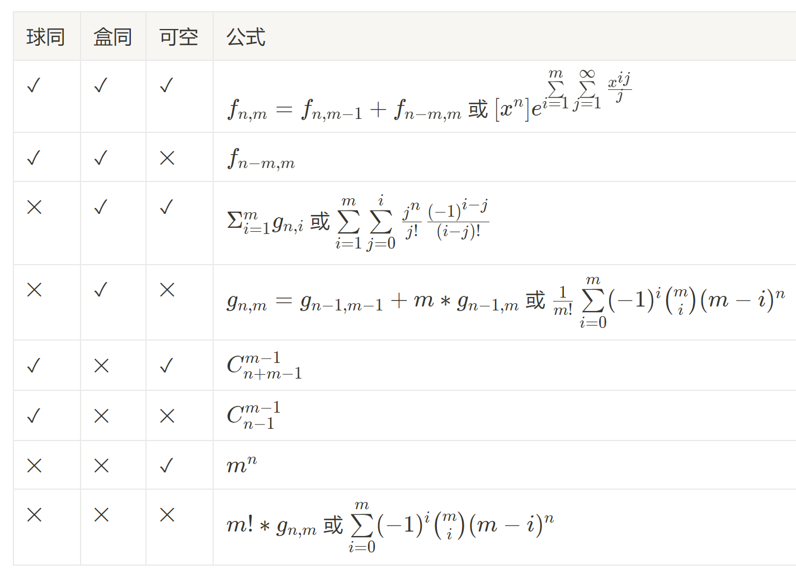

# ACM常用算法模板

<!-- TOC -->

- [数据结构](#%E6%95%B0%E6%8D%AE%E7%BB%93%E6%9E%84)
    - [并查集](#%E5%B9%B6%E6%9F%A5%E9%9B%86)
    - [树状数组](#%E6%A0%91%E7%8A%B6%E6%95%B0%E7%BB%84)
        - [一维](#%E4%B8%80%E7%BB%B4)
        - [二维](#%E4%BA%8C%E7%BB%B4)
        - [三维](#%E4%B8%89%E7%BB%B4)
    - [线段树](#%E7%BA%BF%E6%AE%B5%E6%A0%91)
    - [普通平衡树](#%E6%99%AE%E9%80%9A%E5%B9%B3%E8%A1%A1%E6%A0%91)
        - [树状数组实现](#%E6%A0%91%E7%8A%B6%E6%95%B0%E7%BB%84%E5%AE%9E%E7%8E%B0)
        - [集合平衡树](#%E9%9B%86%E5%90%88%E5%B9%B3%E8%A1%A1%E6%A0%91)
    - [可持久化线段树](#%E5%8F%AF%E6%8C%81%E4%B9%85%E5%8C%96%E7%BA%BF%E6%AE%B5%E6%A0%91)
    - [st 表](#st-%E8%A1%A8)
- [图论](#%E5%9B%BE%E8%AE%BA)
    - [最短路](#%E6%9C%80%E7%9F%AD%E8%B7%AF)
        - [dijkstra](#dijkstra)
    - [树上问题](#%E6%A0%91%E4%B8%8A%E9%97%AE%E9%A2%98)
        - [最近公公祖先](#%E6%9C%80%E8%BF%91%E5%85%AC%E5%85%AC%E7%A5%96%E5%85%88)
        - [树链剖分](#%E6%A0%91%E9%93%BE%E5%89%96%E5%88%86)
    - [强连通分量](#%E5%BC%BA%E8%BF%9E%E9%80%9A%E5%88%86%E9%87%8F)
    - [拓扑排序](#%E6%8B%93%E6%89%91%E6%8E%92%E5%BA%8F)
- [字符串](#%E5%AD%97%E7%AC%A6%E4%B8%B2)
    - [kmp](#kmp)
    - [哈希](#%E5%93%88%E5%B8%8C)
    - [manacher](#manacher)
- [数学](#%E6%95%B0%E5%AD%A6)
    - [扩展欧几里得](#%E6%89%A9%E5%B1%95%E6%AC%A7%E5%87%A0%E9%87%8C%E5%BE%97)
    - [线性代数](#%E7%BA%BF%E6%80%A7%E4%BB%A3%E6%95%B0)
        - [向量公约数](#%E5%90%91%E9%87%8F%E5%85%AC%E7%BA%A6%E6%95%B0)
    - [筛法](#%E7%AD%9B%E6%B3%95)
    - [分解质因数](#%E5%88%86%E8%A7%A3%E8%B4%A8%E5%9B%A0%E6%95%B0)
    - [pollard rho](#pollard-rho)
    - [组合数](#%E7%BB%84%E5%90%88%E6%95%B0)
        - [常用式子](#%E5%B8%B8%E7%94%A8%E5%BC%8F%E5%AD%90)
    - [数论分块](#%E6%95%B0%E8%AE%BA%E5%88%86%E5%9D%97)
    - [积性函数](#%E7%A7%AF%E6%80%A7%E5%87%BD%E6%95%B0)
        - [定义](#%E5%AE%9A%E4%B9%89)
        - [例子](#%E4%BE%8B%E5%AD%90)
    - [狄利克雷卷积](#%E7%8B%84%E5%88%A9%E5%85%8B%E9%9B%B7%E5%8D%B7%E7%A7%AF)
        - [性质](#%E6%80%A7%E8%B4%A8)
        - [例子](#%E4%BE%8B%E5%AD%90)
    - [欧拉函数](#%E6%AC%A7%E6%8B%89%E5%87%BD%E6%95%B0)
    - [莫比乌斯反演](#%E8%8E%AB%E6%AF%94%E4%B9%8C%E6%96%AF%E5%8F%8D%E6%BC%94)
        - [莫比乌斯函数性质](#%E8%8E%AB%E6%AF%94%E4%B9%8C%E6%96%AF%E5%87%BD%E6%95%B0%E6%80%A7%E8%B4%A8)
        - [莫比乌斯变换/反演](#%E8%8E%AB%E6%AF%94%E4%B9%8C%E6%96%AF%E5%8F%98%E6%8D%A2%E5%8F%8D%E6%BC%94)
    - [杜教筛](#%E6%9D%9C%E6%95%99%E7%AD%9B)
        - [示例](#%E7%A4%BA%E4%BE%8B)
    - [多项式](#%E5%A4%9A%E9%A1%B9%E5%BC%8F)
    - [盒子与球](#%E7%9B%92%E5%AD%90%E4%B8%8E%E7%90%83)
        - [球同，盒同，可空](#%E7%90%83%E5%90%8C%E7%9B%92%E5%90%8C%E5%8F%AF%E7%A9%BA)
        - [球不同，盒同，可空](#%E7%90%83%E4%B8%8D%E5%90%8C%E7%9B%92%E5%90%8C%E5%8F%AF%E7%A9%BA)
        - [球同，盒不同，可空](#%E7%90%83%E5%90%8C%E7%9B%92%E4%B8%8D%E5%90%8C%E5%8F%AF%E7%A9%BA)
        - [球同，盒不同，不可空](#%E7%90%83%E5%90%8C%E7%9B%92%E4%B8%8D%E5%90%8C%E4%B8%8D%E5%8F%AF%E7%A9%BA)
        - [球不同，盒不同，可空](#%E7%90%83%E4%B8%8D%E5%90%8C%E7%9B%92%E4%B8%8D%E5%90%8C%E5%8F%AF%E7%A9%BA)
        - [球不同，盒不同，不可空](#%E7%90%83%E4%B8%8D%E5%90%8C%E7%9B%92%E4%B8%8D%E5%90%8C%E4%B8%8D%E5%8F%AF%E7%A9%BA)
    - [线性基](#%E7%BA%BF%E6%80%A7%E5%9F%BA)
    - [矩阵快速幂](#%E7%9F%A9%E9%98%B5%E5%BF%AB%E9%80%9F%E5%B9%82)
- [计算几何](#%E8%AE%A1%E7%AE%97%E5%87%A0%E4%BD%95)
    - [整数](#%E6%95%B4%E6%95%B0)
    - [浮点数](#%E6%B5%AE%E7%82%B9%E6%95%B0)
    - [扫描线](#%E6%89%AB%E6%8F%8F%E7%BA%BF)
- [杂项](#%E6%9D%82%E9%A1%B9)
    - [快读](#%E5%BF%AB%E8%AF%BB)
    - [高精度](#%E9%AB%98%E7%B2%BE%E5%BA%A6)
    - [离散化](#%E7%A6%BB%E6%95%A3%E5%8C%96)
    - [模运算](#%E6%A8%A1%E8%BF%90%E7%AE%97)
    - [分数](#%E5%88%86%E6%95%B0)
    - [表达式求值](#%E8%A1%A8%E8%BE%BE%E5%BC%8F%E6%B1%82%E5%80%BC)
    - [日期](#%E6%97%A5%E6%9C%9F)
    - [builtin函数](#builtin%E5%87%BD%E6%95%B0)
    - [对拍](#%E5%AF%B9%E6%8B%8D)
    - [编译常用选项](#%E7%BC%96%E8%AF%91%E5%B8%B8%E7%94%A8%E9%80%89%E9%A1%B9)
    - [开栈](#%E5%BC%80%E6%A0%88)
    - [clang-format](#clang-format)

<!-- /TOC -->

## 数据结构

### 并查集

```cpp
struct dsu {
    int n;
    vector<int> fa, sz;
    dsu(int _n) : n(_n), fa(n + 1), sz(n + 1, 1) { iota(fa.begin(), fa.end(), 0); }
    int find(int x) { return x == fa[x] ? x : fa[x] = find(fa[x]); }
    bool merge(int x, int y) {
        int fax = find(x), fay = find(y);
        if (fax == fay) return 0;
        sz[fay] += sz[fax];
        fa[fax] = fay;
        return 1;
    }
    int size(int x) { return sz[find(x)]; }
};
```

### 树状数组

#### 一维

```cpp
template <class T>
struct fenwick {
    int n;
    vector<T> t;
    fenwick(int _n) : n(_n), t(n + 1) {}
    T query(int l, int r) {
        auto query = [&](int pos) {
            T res = 0;
            while (pos) {
                res += t[pos];
                pos -= lowbit(pos);
            }
            return res;
        };
        return query(r) - query(l - 1);
    }
    void add(int pos, T num) {
        while (pos <= n) {
            t[pos] += num;
            pos += lowbit(pos);
        }
    }
};
```

#### 二维

```cpp
template <class T>
struct Fenwick_tree_2 {
    Fenwick_tree_2(int n, int m) : n(n), m(m), tree(n + 1, vector<T>(m + 1)) {}
    T query(int l1, int r1, int l2, int r2) {
        auto query = [&](int l, int r) {
            T res = 0;
            for (int i = l; i; i -= lowbit(i))
                for (int j = r; j; j -= lowbit(j)) res += tree[i][j];
            return res;
        };
        return query(l2, r2) - query(l2, r1 - 1) - query(l1 - 1, r2) + query(l1 - 1, r1 - 1);
    }
    void update(int x, int y, T num) {
        for (int i = x; i <= n; i += lowbit(i))
            for (int j = y; j <= m; j += lowbit(j)) tree[i][j] += num;
    }
private:
    int n, m;
    vector<vector<T>> tree;
};
```

#### 三维

```cpp
template <class T>
struct Fenwick_tree_3 {
    Fenwick_tree_3(int n, int m, int k)
        : n(n), m(m), k(k), tree(n + 1, vector<vector<T>>(m + 1, vector<T>(k + 1))) {}
    T query(int a, int b, int c, int d, int e, int f) {
        auto query = [&](int x, int y, int z) {
            T res = 0;
            for (int i = x; i; i -= lowbit(i))
                for (int j = y; j; j -= lowbit(j))
                    for (int p = z; p; p -= lowbit(p)) res += tree[i][j][p];
            return res;
        };
        T res = query(d, e, f);
        res -= query(a - 1, e, f) + query(d, b - 1, f) + query(d, e, c - 1);
        res += query(a - 1, b - 1, f) + query(a - 1, e, c - 1) + query(d, b - 1, c - 1);
        res -= query(a - 1, b - 1, c - 1);
        return res;
    }
    void update(int x, int y, int z, T num) {
        for (int i = x; i <= n; i += lowbit(i))
            for (int j = y; j <= m; j += lowbit(j))
                for (int p = z; p <= k; p += lowbit(p)) tree[i][j][p] += num;
    }
private:
    int n, m, k;
    vector<vector<vector<T>>> tree;
};
```

### 线段树

```cpp
struct Node {
    int l, r;
    ll sum;
    ll x = 0;
};

class SegmentTree {
#define ls rt * 2
#define rs ls + 1
    int n;
    vector<Node> tr;
    void pushup(int rt) {
        // here
        tr[rt].sum = tr[ls].sum + tr[rs].sum;
    }
    void add(int rt, int x) {
        // here
        tr[rt].sum += x * (tr[rt].r - tr[rt].l + 1);
        tr[rt].x += x;
    }
    void pushdown(int rt) {
        // here
        add(ls, tr[rt].x);
        add(rs, tr[rt].x);
        tr[rt].x = 0;
    }
    void build(vector<Node>& a, int rt, int l, int r) {
        tr[rt].l = l;
        tr[rt].r = r;
        if (l == r) {
            // here
            tr[rt].sum = a[l].sum;
            return;
        }
        int mid = (l + r) / 2;
        build(a, ls, l, mid);
        build(a, rs, mid + 1, r);
        pushup(rt);
    }
    // here
    void update(int rt, int l, int r, int x) {
        if (l <= tr[rt].l && tr[rt].r <= r) {
            add(rt, x);
            return;
        }
        pushdown(rt);
        if (l <= tr[ls].r) update(ls, l, r, x);
        if (r >= tr[rs].l) update(rs, l, r, x);
        pushup(rt);
    }
    ll query(int rt, int l, int r) {
        // here
        if (l <= tr[rt].l && tr[rt].r <= r) return tr[rt].sum;
        pushdown(rt);
        // here
        ll sum = 0;
        if (l <= tr[ls].r) sum += query(ls, l, r);
        if (r >= tr[rs].l) sum += query(rs, l, r);
        return sum;
    }

public:
    void update(int l, int r, int x) { update(1, l, r, x); }
    auto query(int l, int r) { return query(1, l, r); }
    SegmentTree(vector<Node>& a) : tr(a.size() * 4) { build(a, 1, 0, n - 1); }
#undef ls
#undef rs
};
```
### 普通平衡树

#### 树状数组实现
    
需要预先处理出来所有可能的数。

```cpp
int lowbit(int x) { return x & -x; }

template <typename T = int>
class Treap {
    int n;
    vector<int> t;
    vector<T> S;
    vector<T> t2;  // 需要求前k小的数之和再写
    int pos(T x) { return lower_bound(S.begin(), S.end(), x) - S.begin() + 1; }
    int sum(int pos) {
        int res = 0;
        while (pos) {
            res += t[pos];
            pos -= lowbit(pos);
        }
        return res;
    }

public:
    int size = 0;

    Treap(const vector<T>& a) : S(a) {
        sort(S.begin(), S.end());
        S.erase(unique(S.begin(), S.end()), S.end());
        n = S.size();
        t = vector<int>(n + 1);
        t2 = vector<T>(n + 1);  // 需要求前k小的数之和再写
    }

    // 插入cnt个x
    void insert(T x, int cnt) {
        size += cnt;
        int i = pos(x);
        assert(i <= n && S[i - 1] == x);
        for (; i <= n; i += lowbit(i)) {
            t[i] += cnt;
            t2[i] += cnt * x;  // 需要求前k小的数之和再写
        }
    }

    // 删除cnt个x
    void erase(T x, int cnt) {
        assert(cnt <= count(x));
        insert(x, -cnt);
    }

    // x的排名
    int rank(T x) {
        assert(count(x));
        return sum(pos(x) - 1) + 1;
    }

    // 统计出现次数
    int count(T x) { return sum(pos(x)) - sum(pos(x) - 1); }

    // 第k小
    T kth(int k) {
        assert(0 < k && k <= size);
        int cnt = 0, x = 0;
        for (int i = __lg(n); i >= 0; i--) {
            x += 1 << i;
            if (x >= n || cnt + t[x] >= k) x -= 1 << i;
            else cnt += t[x];
        }
        return S[x];
    }

    // 前k小的数之和
    T presum(int k) {
        assert(0 < k && k <= size);
        int cnt = 0, x = 0;
        T res = 0;
        for (int i = __lg(n); i >= 0; i--) {
            x += 1 << i;
            if (x >= n || cnt + t[x] >= k) x -= 1 << i;
            else {
                cnt += t[x];
                res += t2[x];
            }
        }
        return res + (k - cnt) * S[x];
    }

    // 小于x，最大的数
    optional<T> prev(T x) {
        int k = pos(x) - 1;
        if (k == 0) return nullopt;
        return kth(sum(k));
    }

    // 大于x，最小的数
    optional<T> next(T x) {
        int k = sum(pos(x)) + 1;
        if (k == size + 1) return nullopt;
        return kth(sum(k));
    }
};
```

#### 线段树实现

```cpp
template <typename T = int>
class Treap {
#define ls tr[pos].l
#define rs tr[pos].r
    struct Node {
        T l = 0, r = 0;
        int cnt = 0;
    };
    vector<Node> tr{Node{}, Node{}};
    void newson(int pos) {
        if (!ls) {
            ls = tr.size();
            tr.push_back({});
        }
        if (!rs) {
            rs = tr.size();
            tr.push_back({});
        }
    }
    void insert(int pos, T l, T r, T x, int cnt) {
        tr[pos].cnt += cnt;
        if (l == r) return;
        newson(pos);
        T mid = (l + r) >> 1;
        if (x <= mid) insert(ls, l, mid, x, cnt);
        else insert(rs, mid + 1, r, x, cnt);
    }
    int query(int pos, T l, T r, T L, T R) {
        if (R < l || L > r) return 0;
        if (L <= l && r <= R) return tr[pos].cnt;
        newson(pos);
        T mid = (l + r) >> 1;
        return query(ls, l, mid, L, R) + query(rs, mid + 1, r, L, R);
    }
    T kth(int pos, T l, T r, int k) {
        if (l == r) return l;
        T mid = (l + r) >> 1;
        if (k <= tr[ls].cnt) return kth(ls, l, mid, k);
        return kth(rs, mid + 1, r, k - tr[ls].cnt);
    }

public:
    int size = 0;
    static constexpr T min = numeric_limits<T>::min() / 2;
    static constexpr T max = numeric_limits<T>::max() / 2;

    // 插入cnt个x
    void insert(T x, int cnt) {
        size += cnt;
        insert(1, min, max, x, cnt);
    }

    // 删除cnt个x
    void erase(T x, int cnt) {
        size -= cnt;
        insert(1, min, max, x, -cnt);
    }

    // 统计出现次数
    int count(T x) { return query(1, min, max, x, x); }

    // x 的排名
    int rank(T x) { return query(1, min, max, min, x - 1) + 1; }

    // 第k小
    T kth(int k) {
        assert(0 < k && k <= size);
        return kth(1, min, max, k);
    }

    // 小于x，最大的数
    optional<T> prev(T x) {
        int k = rank(x) - 1;
        if (k == 0) return nullopt;
        return kth(k);
    }

    // 大于x，最小的数
    optional<T> next(T x) {
        int k = rank(x + 1);
        if (k == size + 1) return nullopt;
        return kth(k);
    }

#undef ls
#undef rs
};
```

可求前k小的数之和

```cpp
template <typename T = int>
class Treap {
#define ls tr[pos].l
#define rs tr[pos].r
    struct Node {
        T l = 0, r = 0;
        int cnt = 0;
        T sum = 0;
    };
    vector<Node> tr{Node{}, Node{}};
    void newson(int pos) {
        if (!ls) {
            ls = tr.size();
            tr.push_back({});
        }
        if (!rs) {
            rs = tr.size();
            tr.push_back({});
        }
    }
    void insert(int pos, T l, T r, T x, int cnt) {
        tr[pos].cnt += cnt;
        tr[pos].sum += x * cnt;
        if (l == r) return;
        newson(pos);
        T mid = (l + r) >> 1;
        if (x <= mid) insert(ls, l, mid, x, cnt);
        else insert(rs, mid + 1, r, x, cnt);
    }
    pair<int, T> query(int pos, T l, T r, T L, T R) {
        if (R < l || L > r) return {0, 0};
        if (L <= l && r <= R) return {tr[pos].cnt, tr[pos].sum};
        newson(pos);
        T mid = (l + r) >> 1;
        auto [cnt1, sum1] = query(ls, l, mid, L, R);
        auto [cnt2, sum2] = query(rs, mid + 1, r, L, R);
        return {cnt1 + cnt2, sum1 + sum2};
    }
    T kth(int pos, T l, T r, int k) {
        if (l == r) return l;
        T mid = (l + r) >> 1;
        if (k <= tr[ls].cnt) return kth(ls, l, mid, k);
        return kth(rs, mid + 1, r, k - tr[ls].cnt);
    }

public:
    int size = 0;
    static constexpr T min = numeric_limits<T>::min() / 2;
    static constexpr T max = numeric_limits<T>::max() / 2;

    // 插入cnt个x
    void insert(T x, int cnt) {
        size += cnt;
        insert(1, min, max, x, cnt);
    }

    // 删除cnt个x
    void erase(T x, int cnt) {
        size -= cnt;
        insert(1, min, max, x, -cnt);
    }

    // 统计出现次数
    int count(T x) { return query(1, min, max, x, x).first; }

    // x 的排名
    int rank(T x) { return query(1, min, max, min, x - 1).first + 1; }

    // 第k小
    T kth(int k) {
        assert(0 < k && k <= size);
        return kth(1, min, max, k);
    }

    // 前k小的数之和
    T presum(int k) {
        assert(0 < k && k <= size);
        T x = kth(k);
        auto [cnt, sum] = query(1, min, max, min, x);
        return sum - (cnt - k) * x;
    }

    // 小于x，最大的数
    optional<T> prev(T x) {
        int k = rank(x) - 1;
        if (k == 0) return nullopt;
        return kth(k);
    }

    // 大于x，最小的数
    optional<T> next(T x) {
        int k = rank(x + 1);
        if (k == size + 1) return nullopt;
        return kth(k);
    }

#undef ls
#undef rs
};
```
#### 集合平衡树

```cpp
template <typename T = ull>
struct treap_set {
    static constexpr int w = 64;
    static constexpr T bit(int i) { return (T)1 << i; }
    int n;
    vector<vector<T>> nodes;

    treap_set(int _n) : n(_n) {
        do {
            nodes.emplace_back(_n = (_n + w - 1) / w);
        } while (_n > 1);
    }
    treap_set(const string &s) : n(s.size()) {
        int _n = n;
        do {
            nodes.emplace_back(_n = (_n + w - 1) / w);
        } while (_n > 1);
        for (int i = 0; i < n; i++)
            if (s[i] == '1') nodes[0][i / w] |= bit(i % w);
        for (int i = 1; i < nodes.size(); i++) {
            for (int j = 0; j < nodes[i - 1].size(); j++)
                if (nodes[i - 1][j]) nodes[i][j / w] |= bit(j % w);
        }
    }
    void clear() {
        for (auto &i : nodes) fill(i.begin(), i.end(), 0);
    }
    void insert(int k) {
        for (auto &node : nodes) {
            node[k / w] |= bit(k % w);
            k /= w;
        }
    }
    void erase(int k) {
        for (auto &node : nodes) {
            node[k / w] &= ~bit(k % w);
            k /= w;
            if (node[k]) break;
        }
    }
    bool contains(int k) { return nodes[0][k / w] & bit(k % w); }
    // Find the smallest key greater than k.
    optional<int> next(int k) {
        for (int i = 0; i < nodes.size(); i++, k /= w) {
            if (k % w == w - 1) continue;
            T keys = nodes[i][k / w] & ~(bit(k % w + 1) - 1);
            if (keys == 0) continue;
            k = k / w * w + __countr_zero(keys);
            for (int j = i - 1; j >= 0; j--) k = k * w + __countr_zero(nodes[j][k]);
            return k;
        }
        return nullopt;
    }
    // Find the largest key samller than k.
    optional<int> prev(int k) {
        for (int i = 0; i < nodes.size(); i++, k /= w) {
            if (k % w == 0) continue;
            T keys = nodes[i][k / w] & (bit(k % w) - 1);
            if (keys == 0) continue;
            k = k / w * w + w - 1 - __countl_zero(keys);
            for (int j = i - 1; j >= 0; j--) k = k * w + w - 1 - __countl_zero(nodes[j][k]);
            return k;
        }
        return nullopt;
    }
};
```

### 可持久化线段树

```cpp
template <typename T>
class PersistentSeg {
#define mid (l + r) / 2
    int n;
    struct Node {
        int l, r;
        int cnt = 0;
    };
    vector<Node> tr;
    vector<int> root;
    vector<T> S;
    int lson(int pos) { return tr[pos].l; }
    int rson(int pos) { return tr[pos].r; }

    int build(int l, int r) {
        if (l == r) {
            tr.push_back({});
            return tr.size() - 1;
        }
        tr.push_back({build(l, mid), build(mid + 1, r)});
        return tr.size() - 1;
    }
    int update(int pos, int idx, int l, int r) {
        if (l == r) {
            tr.push_back({0, 0, tr[pos].cnt + 1});
            return tr.size() - 1;
        }
        int ls = lson(pos), rs = rson(pos);
        if (idx <= mid) ls = update(ls, idx, l, mid);
        else rs = update(rs, idx, mid + 1, r);
        tr.push_back({ls, rs, tr[ls].cnt + tr[rs].cnt});
        return tr.size() - 1;
    }
    int query(int pos1, int pos2, int l, int r, int k) {
        if (l == r) return S[l];
        int lcnt = tr[lson(pos2)].cnt - tr[lson(pos1)].cnt;
        if (k <= lcnt) return query(lson(pos1), lson(pos2), l, mid, k);
        return query(rson(pos1), rson(pos2), mid + 1, r, k - lcnt);
    }
    int query2(int pos1, int pos2, int l, int r, int L, int R) {
        if (L <= S[l] && S[r] <= R) return tr[pos2].cnt - tr[pos1].cnt;
        int res = 0;
        if (L <= S[mid]) res += query2(lson(pos1), lson(pos2), l, mid, L, R);
        if (R >= S[mid + 1]) res += query2(rson(pos1), rson(pos2), mid + 1, r, L, R);
        return res;
    }

public:
    PersistentSeg(vector<T>& a) : root(a.size() + 1), S(a) {
        sort(S.begin(), S.end());
        S.erase(unique(S.begin(), S.end()), S.end());
        n = S.size();
        root[0] = build(0, n - 1);
        for (int i = 0; i < (int)a.size(); i++) {
            root[i + 1] =
                update(root[i], lower_bound(S.begin(), S.end(), a[i]) - S.begin(), 0, n - 1);
        }
    }

    // 查询区间第k小
    int kth(int l, int r, int k) { return query(root[l], root[r + 1], 0, n - 1, k); }

    // 区间内满足值在[L,R]的个数
    int query(int l, int r, int L, int R) { return query2(root[l], root[r + 1], 0, n - 1, L, R); }
#undef mid
};
```

### st 表

```cpp
auto lg = []() {
    array<int, 10000001> lg;
    lg[1] = 0;
    for (int i = 2; i <= 10000000; i++) lg[i] = lg[i >> 1] + 1;
    return lg;
}();
template <typename T>
struct st {
    int n;
    vector<vector<T>> a;
    st(vector<T>& _a) : n(_a.size()) {
        a.assign(lg[n] + 1, vector<int>(n));
        for (int i = 0; i < n; i++) a[0][i] = _a[i];
        for (int j = 1; j <= lg[n]; j++)
            for (int i = 0; i + (1 << j) - 1 < n; i++)
                a[j][i] = max(a[j - 1][i], a[j - 1][i + (1 << (j - 1))]);
    }
    T query(int l, int r) {
        int k = lg[r - l + 1];
        return max(a[k][l], a[k][r - (1 << k) + 1]);
    }
};
```

## 图论

存图

```cpp
struct Graph {
    int n;
    struct Edge {
        int to, w;
    };
    vector<vector<Edge>> graph;
    Graph(int _n) {
        n = _n;
        graph.assign(n + 1, vector<Edge>());
    };
    void add(int u, int v, int w) { graph[u].push_back({v, w}); }
};
```

### 最短路

#### dijkstra

```cpp
void dij(Graph& graph, vector<int>& dis, int t) {
    vector<int> visit(graph.n + 1, 0);
    priority_queue<pair<int, int>> que;
    dis[t] = 0;
    que.emplace(0, t);
    while (!que.empty()) {
        int u = que.top().second;
        que.pop();
        if (visit[u]) continue;
        visit[u] = 1;
        for (auto& [to, w] : graph.graph[u]) {
            if (dis[to] > dis[u] + w) {
                dis[to] = dis[u] + w;
                que.emplace(-dis[to], to);
            }
        }
    }
}
```

### 树上问题

#### 最近公公祖先

倍增法

```cpp
vector<int> dep;
vector<array<int, 21>> fa;
dep.assign(n + 1, 0);
fa.assign(n + 1, array<int, 21>{});
void binary_jump(int root) {
    function<void(int)> dfs = [&](int t) {
        dep[t] = dep[fa[t][0]] + 1;
        for (auto& [to] : graph[t]) {
            if (to == fa[t][0]) continue;
            fa[to][0] = t;
            dfs(to);
        }
    };
    dfs(root);
    for (int j = 1; j <= 20; j++)
        for (int i = 1; i <= n; i++) fa[i][j] = fa[fa[i][j - 1]][j - 1];
}
int lca(int x, int y) {
    if (dep[x] < dep[y]) swap(x, y);
    for (int i = 20; i >= 0; i--)
        if (dep[fa[x][i]] >= dep[y]) x = fa[x][i];
    if (x == y) return x;
    for (int i = 20; i >= 0; i--) {
        if (fa[x][i] != fa[y][i]) {
            x = fa[x][i];
            y = fa[y][i];
        }
    }
    return fa[x][0];
}
```

树剖

```cpp
int lca(int x, int y) {
    while (top[x] != top[y]) {
        if (dep[top[x]] < dep[top[y]]) swap(x, y);
        x = fa[top[x]];
    }
    if (dep[x] < dep[y]) swap(x, y);
    return y;
}
```

#### 树链剖分

```cpp
vector<int> fa, siz, dep, son, dfn, rnk, top;
fa.assign(n + 1, 0);
siz.assign(n + 1, 0);
dep.assign(n + 1, 0);
son.assign(n + 1, 0);
dfn.assign(n + 1, 0);
rnk.assign(n + 1, 0);
top.assign(n + 1, 0);
void hld(int root) {
    function<void(int)> dfs1 = [&](int t) {
        dep[t] = dep[fa[t]] + 1;
        siz[t] = 1;
        for (auto& [to, w] : graph[t]) {
            if (to == fa[t]) continue;
            fa[to] = t;
            dfs1(to);
            if (siz[son[t]] < siz[to]) son[t] = to;
            siz[t] += siz[to];
        }
    };
    dfs1(root);
    int dfn_tail = 0;
    for (int i = 1; i <= n; i++) top[i] = i;
    function<void(int)> dfs2 = [&](int t) {
        dfn[t] = ++dfn_tail;
        rnk[dfn_tail] = t;
        if (!son[t]) return;
        top[son[t]] = top[t];
        dfs2(son[t]);
        for (auto& [to, w] : graph[t]) {
            if (to == fa[t] || to == son[t]) continue;
            dfs2(to);
        }
    };
    dfs2(root);
}
```

### 强连通分量

```cpp
void tarjan(Graph& g1, Graph& g2) {
    int dfn_tail = 0, cnt = 0;
    vector<int> dfn(g1.n + 1, 0), low(g1.n + 1, 0), exist(g1.n + 1, 0), belong(g1.n + 1, 0);
    stack<int> sta;
    function<void(int)> dfs = [&](int t) {
        dfn[t] = low[t] = ++dfn_tail;
        sta.push(t);
        exist[t] = 1;
        for (auto& [to] : g1.graph[t])
            if (!dfn[to]) {
                dfs(to);
                low[t] = min(low[t], low[to]);
            } else if (exist[to]) low[t] = min(low[t], dfn[to]);
        if (dfn[t] == low[t]) {
            cnt++;
            while (int temp = sta.top()) {
                belong[temp] = cnt;
                exist[temp] = 0;
                sta.pop();
                if (temp == t) break;
            }
        }
    };
    for (int i = 1; i <= g1.n; i++)
        if (!dfn[i]) dfs(i);
    g2 = Graph(cnt);
    for (int i = 1; i <= g1.n; i++) g2.w[belong[i]] += g1.w[i];
    for (int i = 1; i <= g1.n; i++)
        for (auto& [to] : g1.graph[i])
            if (belong[i] != belong[to]) g2.add(belong[i], belong[to]);
}
```

### 拓扑排序

```cpp
void toposort(Graph& g, vector<int>& dis) {
    vector<int> in(g.n + 1, 0);
    for (int i = 1; i <= g.n; i++)
        for (auto& [to] : g.graph[i]) in[to]++;
    queue<int> que;
    for (int i = 1; i <= g.n; i++)
        if (!in[i]) {
            que.push(i);
            dis[i] = g.w[i];  // dp
        }
    while (!que.empty()) {
        int u = que.front();
        que.pop();
        for (auto& [to] : g.graph[u]) {
            in[to]--;
            dis[to] = max(dis[to], dis[u] + g.w[to]);  // dp
            if (!in[to]) que.push(to);
        }
    }
}
```

## 字符串

### kmp

```cpp
auto kmp(string& s) {
    vector next(s.size(), -1);
    for (int i = 1, j = -1; i < s.size(); i++) {
        while (j >= 0 && s[i] != s[j + 1]) j = next[j];
        if (s[i] == s[j + 1]) j++;
        next[i] = j;
    }
    // next 意为长度
    for (auto& i : next) i++;
    return next;
}
```

### 哈希

```cpp
constexpr int N = 1e6;
int pow_base[N + 1][2];
constexpr ll mod[2] = {(int)2e9 + 11, (int)2e9 + 33}, base[2] = {(int)2e5 + 11, (int)2e5 + 33};

struct Hash {
    int size;
    vector<array<int, 2>> a;
    Hash() {}
    Hash(const string& s) {
        size = s.size();
        a.resize(size);
        a[0][0] = a[0][1] = s[0];
        for (int i = 1; i < size; i++) {
            a[i][0] = (a[i - 1][0] * base[0] + s[i]) % mod[0];
            a[i][1] = (a[i - 1][1] * base[1] + s[i]) % mod[1];
        }
    }
    array<int, 2> get(int l, int r) const {
        if (l == 0) return a[r];
        auto getone = [&](bool f) {
            int x = (a[r][f] - 1ll * a[l - 1][f] * pow_base[r - l + 1][f]) % mod[f];
            if (x < 0) x += mod[f];
            return x;
        };
        return {getone(0), getone(1)};
    }
};

auto _ = []() {
    pow_base[0][0] = pow_base[0][1] = 1;
    for (int i = 1; i <= N; i++) {
        pow_base[i][0] = pow_base[i - 1][0] * base[0] % mod[0];
        pow_base[i][1] = pow_base[i - 1][1] * base[1] % mod[1];
    }
    return true;
}();
```

### manacher

```cpp
auto manacher(const string& _s) {
    string s(_s.size() * 2 + 1, '$');
    for (int i = 0; i < _s.size(); i++) s[2 * i + 1] = _s[i];
    vector r(s.size(), 0);
    for (int i = 0, maxr = 0, mid = 0; i < s.size(); i++) {
        if (i < maxr) r[i] = min(r[mid * 2 - i], maxr - i);
        while (i - r[i] - 1 >= 0 && i + r[i] + 1 < s.size() && s[i - r[i] - 1] == s[i + r[i] + 1])
            ++r[i];
        if (i + r[i] > maxr) maxr = i + r[i], mid = i;
    }
    return r;
}
```

## 数学

### 扩展欧几里得

需保证 $a,b>=0$

$x=x+k*dx,y=y-k*dy$

若要求 $x\ge p$，$k\ge\lceil \frac{p-x}{dx}\rceil$

若要求 $x\le q$，$k\le\lfloor \frac{q-x}{dx}\rfloor$

若要求 $y\ge p$，$k\le\lfloor \frac{y-p}{dy}\rfloor$

若要求 $y\le q$，$k\ge\lceil \frac{y-q}{dy}\rceil$

```cpp
int __exgcd(int a, int b, int& x, int& y) {
    if (!b) {
        x = 1;
        y = 0;
        return a;
    }
    int g = __exgcd(b, a % b, y, x);
    y -= a / b * x;
    return g;
}

array<int, 2> exgcd(int a, int b, int c) {
    int x, y;
    int g = __exgcd(a, b, x, y);
    if (c % g) return {INT_MAX, INT_MAX};
    int dx = b / g;
    int dy = a / g;
    x = c / g % dx * x % dx;
    if (x < 0) x += dx;
    y = (c - a * x) / b;
    return {x, y};
}
```

### 线性代数

#### 向量公约数

```cpp
// 将这两个向量组转化为b.y=0的形式
array<vec, 2> gcd(vec a, vec b) {
    while (b.y != 0) {
        int t = a.y / b.y;
        a = a - b * t;
        swap(a, b);
    }
    return {a, b};
}

array<vec, 2> gcd(array<vec, 2> g, vec a) {
    auto [b, c] = gcd(g[0], a);
    g[0] = b;
    g[1] = vec(gcd(g[1].x, c.x), 0);
    if (g[1].x != 0) g[0].x %= g[1].x;
    return g;
}
```

### 筛法

primes

```cpp
constexpr int N = 1e7;
bitset<N + 1> ispr;
vector<int> primes;
bool _ = []() {
    ispr.set();
    ispr[0] = ispr[1] = 0;
    for (int i = 2; i <= N; i++) {
        if (!ispr[i]) continue;
        primes.push_back(i);
        for (int j = 2 * i; j <= N; j += i) ispr[j] = 0;
    }
    return 1;
}();
```

$\varphi$

```cpp
constexpr int N = 1e7;
array<int, N + 1> phi;
auto _ = []() {
    iota(phi.begin() + 1, phi.end(), 1);
    for (int i = 2; i <= N; i++) {
        if (phi[i] == i)
            for (int j = i; j <= N; j += i) phi[j] = phi[j] / i * (i - 1);
    }
    return true;
}();
```

$\mu$

```cpp
constexpr int N = 1e7;
bitset<N + 1> ispr;
array<int, N + 1> mu;
auto _ = []() {
    mu.fill(1);
    ispr.set();
    mu[0] = ispr[0] = ispr[1] = 0;
    for (int i = 2; i <= N; i++) {
        if (!ispr[i]) continue;
        mu[i] = -1;
        for (int j = 2 * i; j <= N; j += i) {
            ispr[j] = 0;
            if (j / i % i == 0) mu[j] = 0;
            else mu[j] *= -1;
        }
    }
    return true;
}();
```

prime $\varphi$

```cpp
constexpr int N = 1e7;
bitset<N + 1> ispr;
array<int, N + 1> phi;
vector<int> primes;
bool _ = []() {
    ispr.set();
    ispr[0] = ispr[1] = 0;
    iota(phi.begin() + 1, phi.end(), 1);
    for (int i = 2; i <= N; i++) {
        if (!ispr[i]) continue;
        phi[i] = i - 1;
        primes.push_back(i);
        for (int j = 2 * i; j <= N; j += i) {
            ispr[j] = 0;
            phi[j] = phi[j] / i * (i - 1);
        }
    }
    return 1;
}();
```

prime $\mu$

```cpp
constexpr int N = 1e7;
bitset<N + 1> ispr;
array<int, N + 1> mu;
vector<int> primes;
bool _ = []() {
    mu.fill(1);
    ispr.set();
    mu[0] = ispr[0] = ispr[1] = 0;
    for (int i = 2; i <= N; i++) {
        if (!ispr[i]) continue;
        mu[i] = -1;
        primes.push_back(i);
        for (int j = 2 * i; j <= N; j += i) {
            ispr[j] = 0;
            if (j / i % i == 0) mu[j] = 0;
            else mu[j] *= -1;
        }
    }
    return 1;
}();
```

prime $\mu$ $\varphi$

```cpp
constexpr int N = 1e7;
bitset<N + 1> ispr;
array<int, N + 1> mu, phi;
vector<int> primes;
bool _ = []() {
    mu.fill(1);
    ispr.set();
    mu[0] = ispr[0] = ispr[1] = 0;
    iota(phi.begin() + 1, phi.end(), 1);
    for (int i = 2; i <= N; i++) {
        if (!ispr[i]) continue;
        mu[i] = -1;
        phi[i] = i - 1;
        primes.push_back(i);
        for (int j = 2 * i; j <= N; j += i) {
            ispr[j] = 0;
            if (j / i % i == 0) mu[j] = 0;
            else mu[j] *= -1;
            phi[j] = phi[j] / i * (i - 1);
        }
    }
    return 1;
}();
```

```cpp
constexpr int N = 1e7;
array<int, N + 1> minpr, mu, phi;
vector<int> primes;
bool _ = []() {
    phi[1] = mu[1] = 1;
    for (int i = 2; i <= N; i++) {
        if (minpr[i] == 0) {
            minpr[i] = i;
            mu[i] = -1;
            phi[i] = i - 1;
            primes.push_back(i);
        }
        for (auto& j : primes) {
            if (i * j > N) break;
            minpr[i * j] = j;
            if (j < minpr[i]) {
                phi[i * j] = phi[i] * phi[j];
                mu[i * j] = -mu[i];
            } else {
                mu[i * j] = 0;
                phi[i * j] = phi[i] * j;
                break;
            }
        }
    }
    return 1;
}();
```

### 分解质因数

```cpp
auto getprimes(int n) {
    vector<array<int, 2>> res;
    for (auto& i : primes) {
        if (i > n / i) break;
        if (n % i == 0) {
            res.push_back({i, 0});
            while (n % i == 0) {
                n /= i;
                res.back()[1]++;
            }
        }
    }
    if (n > 1) res.push_back({n, 1});
    return res;
}
```

### pollard rho

```cpp
using LL = __int128_t;

random_device rd;
mt19937 seed(rd());

ll power(ll a, ll b, ll mod) {
    ll res = 1;
    while (b) {
        if (b & 1) res = (LL)res * a % mod;
        a = (LL)a * a % mod;
        b >>= 1;
    }
    return res;
}

bool isprime(ll n) {
    static array primes{2, 3, 5, 7, 11, 13, 17, 19, 23};
    static unordered_map<ll, bool> S;
    if (n < 2) return 0;
    if (S.count(n)) return S[n];
    ll d = n - 1, r = 0;
    while (!(d & 1)) {
        r++;
        d >>= 1;
    }
    for (auto& a : primes) {
        if (a == n) return S[n] = 1;
        ll x = power(a, d, n);
        if (x == 1 || x == n - 1) continue;
        for (int i = 0; i < r - 1; i++) {
            x = (LL)x * x % n;
            if (x == n - 1) break;
        }
        if (x != n - 1) return S[n] = 0;
    }
    return S[n] = 1;
}

ll pollard_rho(ll n) {
    ll s = 0, t = 0;
    ll c = seed() % (n - 1) + 1;
    ll val = 1;
    for (int goal = 1;; goal *= 2, s = t, val = 1) {
        for (int step = 1; step <= goal; step++) {
            t = ((LL)t * t + c) % n;
            val = (LL)val * abs(t - s) % n;
            if (step % 127 == 0) {
                ll g = gcd(val, n);
                if (g > 1) return g;
            }
        }
        ll g = gcd(val, n);
        if (g > 1) return g;
    }
}
auto getprimes(ll n) {
    unordered_set<ll> S;
    auto get = [&](auto self, ll n) {
        if (n < 2) return;
        if (isprime(n)) {
            S.insert(n);
            return;
        }
        ll mx = pollard_rho(n);
        self(self, n / mx);
        self(self, mx);
    };
    get(get, n);
    return S;
}
```

### 组合数

```cpp
constexpr int N = 1e6;
array<modint, N + 1> fac, ifac;

modint C(int n, int m) {
    if (m < 0 || m > n) return 0;
    if (n <= mod) return fac[n] * ifac[m] * ifac[n - m];
    // n >= mod 时需要这个
    return C(n % mod, m % mod) * C(n / mod, m / mod);
}

auto _ = []() {
    fac[0] = 1;
    for (int i = 1; i <= N; i++) fac[i] = fac[i - 1] * i;
    ifac[N] = fac[N].inv();
    for (int i = N - 1; i >= 0; i--) ifac[i] = ifac[i + 1] * (i + 1);
    return true;
}();
```

#### 常用式子

- $\binom{n}{k} = \frac{n}{k} \binom{n-1}{k-1}$
- $\binom{n}{k} = \frac{n-k}{k} \binom{n}{k-1}$
- $\sum_{i=0}^n(-1)^i\binom{n}{i}=[n=0]$
- $\sum_{i=0}^m \binom{n}{i}\binom{m}{i} = \binom{m+n}{m}$
- $\sum_{i=0}^n\binom{n}{i}^2=\binom{2n}{n}$
- $\sum_{i=0}^ni\binom{n}{i}=n2^{n-1}$
- $\sum_{i=0}^ni^2\binom{n}{i}=n(n+1)2^{n-2}$
- $\sum_{l=0}^n\binom{l}{k} = \binom{n+1}{k+1}$
- $\binom{n}{r}\binom{r}{k} = \binom{n}{k}\binom{n-k}{r-k}$
- $\sum_{i=0}^n\binom{n-i}{i}=F_{n+1}$，其中 $F$ 是斐波那契数列。
- $\sum_{i=0}^k\dbinom{n}{i}\dbinom{m}{k-i}=\dbinom{n+m}{k}$
- $\sum_{i=1}^{n}\dbinom{n}{i}\dbinom{n}{i-1}=\dbinom{2n}{n+1}$
- $m^n = \sum_{i=0}^{m}{n \brace i}\binom{m}{i}i!$

### 数论分块

求解形如 $\sum_{i=1}^{n}f(i)g(\lfloor\frac{n}{i}\rfloor)$ 的合式

$s(n) = \sum_{i=1}^{n}f(i)$

```cpp
modint sqrt_decomposition(int n) {
    auto s = [&](int x) { return x; };
    auto g = [&](int x) { return x; };
    modint res = 0;
    while (l <= R) {
        int r = n / (n / l);
        res = res + (s(r) - s(l - 1)) * g(n / l);
        l = r + 1;
    }
    return res;
}
```

### 积性函数

#### 定义

函数 $f(n)$ 满足 $f(1)=1$ 且 $\forall x,y\in\mathbf{N}^*,\gcd(x,y)=1$ 都有 $f(xy)=f(x)f(y)$，则 $f(n)$ 为积性函数。

函数 $f(n)$ 满足 $f(1)=1$ 且 $\forall x,y\in\mathbf{N}^*$ 都有 $f(xy)=f(x)f(y)$，则 $f(n)$ 为完全积性函数。

#### 例子

- 单位函数：$\varepsilon(n)=[n=1]$。（完全积性）
- 恒等函数：$\operatorname{id}_k(n)=n^k$。（完全积性）
- 常数函数：$1(n)=1$。（完全积性）
- 除数函数：$\sigma_{k}(n)=\sum_{d\mid n}d^{k}$。$\sigma_{0}(n)$ 通常简记作 $d(n)$ 或 $\tau(n)$，$\sigma_{1}(n)$ 通常简记作 $\sigma(n)$。
- 欧拉函数：$\varphi(n)=\sum_{i=1}^n[\gcd(i,n)=1]$。
- 莫比乌斯函数：$\mu(n)=\begin{cases}1&n=1\\0&\exists d>1,d^{2}\mid n\\(-1)^{\omega(n)}&\text{otherwise}\end{cases}$，其中 $\omega(n)$ 表示 $n$ 的本质不同质因子个数，它是一个加性函数。

### 狄利克雷卷积

对于两个数论函数 $f(x)$ 和 $g(x)$，则它们的狄利克雷卷积得到的结果 $h(x)$ 定义为：

$h(x)=\sum_{d\mid x}{f(d)g\left(\dfrac xd \right)}=\sum_{ab=x}{f(a)g(b)}$

可以简记为：$h=f*g$。

#### 性质

**交换律：**$f*g=g*f$。

**结合律：**$(f*g)*h=f*(g*h)$。

**分配律：**$(f+g)*h=f*h+g*h$。

**等式的性质：**$f=g$ 的充要条件是 $f*h=g*h$，其中数论函数 $h(x)$ 要满足 $h(1)\ne 0$。

#### 例子

- $\varepsilon=\mu \ast 1\iff\varepsilon(n)=\sum_{d\mid n}\mu(d)$
- $id = \varphi * 1 \iff id(n)=\sum_{d\mid n} \varphi(d)$
- $d=1 \ast 1\iff d(n)=\sum_{d\mid n}1$
- $\sigma=\operatorname{id} \ast 1\iff\sigma(n)=\sum_{d\mid n}d$
- $\varphi=\mu \ast \operatorname{id}\iff\varphi(n)=\sum_{d\mid n}d\cdot\mu(\frac{n}{d})$

### 欧拉函数

```cpp
constexpr int N = 1e6;
array<int, N + 1> phi;
auto _ = []() {
    iota(phi.begin() + 1, phi.end(), 1);
    for (int i = 2; i <= N; i++) {
        if (phi[i] == i)
            for (int j = i; j <= N; j += i) phi[j] = phi[j] / i * (i - 1);
    }
    return true;
}();
```

### 莫比乌斯反演

#### 莫比乌斯函数性质

- $\sum_{d\mid n}\mu(d)=\begin{cases}1&n=1\\0&n\neq 1\\\end{cases}$，即 $\sum_{d\mid n}\mu(d)=\varepsilon(n)$，$\mu * 1 =\varepsilon$
- $\displaystyle [\gcd(i,j)=1]=\sum_{d\mid\gcd(i,j)}\mu(d)$

```cpp
constexpr int N = 1e6;
array<int, N + 1> miu;
array<bool, N + 1> ispr;

auto _ = []() {
    miu.fill(1);
    ispr.fill(1);
    for (int i = 2; i <= N; i++) {
        if (!ispr[i]) continue;
        miu[i] = -1;
        for (int j = 2 * i; j <= N; j += i) {
            ispr[j] = 0;
            if ((j / i) % i == 0) miu[j] = 0;
            else miu[j] *= -1;
        }
    }
    return true;
}();
```

#### 莫比乌斯变换/反演

$f(n)=\sum_{d\mid n}g(d)$，那么有 $g(n)=\sum_{d\mid n}\mu(d)f(\frac{n}{d})=\sum_{n|d}\mu(\frac{d}{n})f(d)$
。

用狄利克雷卷积表示则为 $f=g\ast1$，有 $g=f\ast\mu$。

$f \rightarrow g$ 称为莫比乌斯反演，$g \rightarrow f$ 称为莫比乌斯反演。

### 杜教筛

杜教筛被用于处理一类数论函数的前缀和问题。对于数论函数 $f$，杜教筛可以在低于线性时间的复杂度内计算 $S(n)=\sum_{i=1}^{n}f(i)$。

$$
\begin{aligned}
    S(n) & = \frac{\sum_{i=1}^n (f * g)(i) - \sum_{i=2}^n g(i)S\left(\left\lfloor\frac{n}{i}\right\rfloor\right)}{g(1)}
\end{aligned}
$$

可以构造恰当的数论函数 $g$ 使得：

- 可以快速计算 $\sum_{i=1}^n(f * g)(i)$。
- 可以快速计算 $g$ 的单点值，用数论分块求解 $\sum_{i=2}^ng(i)S\left(\left\lfloor\frac{n}{i}\right\rfloor\right)$。

#### 示例

```cpp
ll sum_phi(ll n) {
    if (n <= N) return sp[n];
    if (sp2.count(n)) return sp2[n];
    ll res = 0, l = 2;
    while (l <= n) {
        ll r = n / (n / l);
        res = res + (r - l + 1) * sum_phi(n / l);
        l = r + 1;
    }
    return sp2[n] = (ll)n * (n + 1) / 2 - res;
}

ll sum_miu(ll n) {
    if (n <= N) return sm[n];
    if (sm2.count(n)) return sm2[n];
    ll res = 0, l = 2;
    while (l <= n) {
        ll r = n / (n / l);
        res = res + (r - l + 1) * sum_miu(n / l);
        l = r + 1;
    }
    return sm2[n] = 1 - res;
}
```

### 多项式

```cpp
#define countr_zero(n) __builtin_ctz(n)
constexpr int N = 1e6;
array<int, N + 1> inv;

int power(int a, int b) {
    int res = 1;
    while (b) {
        if (b & 1) res = 1ll * res * a % mod;
        a = 1ll * a * a % mod;
        b >>= 1;
    }
    return res;
}

namespace NFTS {
int g = 3;
vector<int> rev, roots{0, 1};
void dft(vector<int> &a) {
    int n = a.size();
    if (rev.size() != n) {
        int k = countr_zero(n) - 1;
        rev.resize(n);
        for (int i = 0; i < n; ++i) rev[i] = rev[i >> 1] >> 1 | (i & 1) << k;
    }
    if (roots.size() < n) {
        int k = countr_zero(roots.size());
        roots.resize(n);
        while ((1 << k) < n) {
            int e = power(g, (mod - 1) >> (k + 1));
            for (int i = 1 << (k - 1); i < (1 << k); ++i) {
                roots[2 * i] = roots[i];
                roots[2 * i + 1] = 1ll * roots[i] * e % mod;
            }
            ++k;
        }
    }
    for (int i = 0; i < n; ++i)
        if (rev[i] < i) swap(a[i], a[rev[i]]);
    for (int k = 1; k < n; k *= 2) {
        for (int i = 0; i < n; i += 2 * k) {
            for (int j = 0; j < k; ++j) {
                int u = a[i + j];
                int v = 1ll * a[i + j + k] * roots[k + j] % mod;
                int x = u + v, y = u - v;
                if (x >= mod) x -= mod;
                if (y < 0) y += mod;
                a[i + j] = x;
                a[i + j + k] = y;
            }
        }
    }
}
void idft(vector<int> &a) {
    int n = a.size();
    reverse(a.begin() + 1, a.end());
    dft(a);
    int inv_n = power(n, mod - 2);
    for (int i = 0; i < n; ++i) a[i] = 1ll * a[i] * inv_n % mod;
}
}  // namespace NFTS

struct poly {
    poly &format() {
        while (!a.empty() && a.back() == 0) a.pop_back();
        return *this;
    }
    poly &reverse() {
        ::reverse(a.begin(), a.end());
        return *this;
    }
    vector<int> a;
    poly() {}
    poly(int x) {
        if (x) a = {x};
    }
    poly(const vector<int> &_a) : a(_a) {}
    int size() const { return a.size(); }
    int &operator[](int id) { return a[id]; }
    int at(int id) const {
        if (id < 0 || id >= (int)a.size()) return 0;
        return a[id];
    }
    poly operator-() const {
        auto A = *this;
        for (auto &x : A.a) x = (x == 0 ? 0 : mod - x);
        return A;
    }
    poly mulXn(int n) const {
        auto b = a;
        b.insert(b.begin(), n, 0);
        return poly(b);
    }
    poly modXn(int n) const {
        if (n > size()) return *this;
        return poly({a.begin(), a.begin() + n});
    }
    poly divXn(int n) const {
        if (size() <= n) return poly();
        return poly({a.begin() + n, a.end()});
    }
    poly &operator+=(const poly &rhs) {
        if (size() < rhs.size()) a.resize(rhs.size());
        for (int i = 0; i < rhs.size(); ++i)
            if ((a[i] += rhs.a[i]) >= mod) a[i] -= mod;
        return *this;
    }
    poly &operator-=(const poly &rhs) {
        if (size() < rhs.size()) a.resize(rhs.size());
        for (int i = 0; i < rhs.size(); ++i)
            if ((a[i] -= rhs.a[i]) < 0) a[i] += mod;
        return *this;
    }
    poly &operator*=(poly rhs) {
        int n = size(), m = rhs.size(), tot = max(1, n + m - 1);
        int sz = 1 << __lg(tot * 2 - 1);
        a.resize(sz);
        rhs.a.resize(sz);
        NFTS::dft(a);
        NFTS::dft(rhs.a);
        for (int i = 0; i < sz; ++i) a[i] = 1ll * a[i] * rhs.a[i] % mod;
        NFTS::idft(a);
        return *this;
    }
    poly &operator/=(poly rhs) {
        int n = size(), m = rhs.size();
        if (n < m) return (*this) = poly();
        reverse();
        rhs.reverse();
        (*this) *= rhs.inv(n - m + 1);
        a.resize(n - m + 1);
        reverse();
        return *this;
    }
    poly &operator%=(poly rhs) { return (*this) -= (*this) / rhs * rhs; }
    poly operator+(const poly &rhs) const { return poly(*this) += rhs; }
    poly operator-(const poly &rhs) const { return poly(*this) -= rhs; }
    poly operator*(poly rhs) const { return poly(*this) *= rhs; }
    poly operator/(poly rhs) const { return poly(*this) /= rhs; }
    poly operator%(poly rhs) const { return poly(*this) %= rhs; }
    poly powModPoly(int n, poly p) {
        poly r(1), x(*this);
        while (n) {
            if (n & 1) (r *= x) %= p;
            (x *= x) %= p;
            n >>= 1;
        }
        return r;
    }
    int inner(const poly &rhs) {
        int r = 0, n = min(size(), rhs.size());
        for (int i = 0; i < n; ++i) r = (r + 1ll * a[i] * rhs.a[i]) % mod;
        return r;
    }
    poly derivation() const {
        if (a.empty()) return poly();
        int n = size();
        vector<int> r(n - 1);
        for (int i = 1; i < n; ++i) r[i - 1] = 1ll * a[i] * i % mod;
        return poly(r);
    }
    poly integral() const {
        if (a.empty()) return poly();
        int n = size();
        vector<int> r(n + 1);
        for (int i = 0; i < n; ++i) r[i + 1] = 1ll * a[i] * ::inv[i + 1] % mod;
        return poly(r);
    }
    poly inv(int n) const {
        assert(a[0] != 0);
        poly x(power(a[0], mod - 2));
        int k = 1;
        while (k < n) {
            k *= 2;
            x *= (poly(2) - modXn(k) * x).modXn(k);
        }
        return x.modXn(n);
    }
    // 需要保证首项为 1
    poly log(int n) const { return (derivation() * inv(n)).integral().modXn(n); }
    // 需要保证首项为 0
    poly exp(int n) const {
        poly x(1);
        int k = 1;
        while (k < n) {
            k *= 2;
            x = (x * (poly(1) - x.log(k) + modXn(k))).modXn(k);
        }
        return x.modXn(n);
    }
    // 需要保证首项为 1，开任意次方可以先 ln 再 exp 实现。
    poly sqrt(int n) const {
        poly x(1);
        int k = 1;
        while (k < n) {
            k *= 2;
            x += modXn(k) * x.inv(k);
            x = x.modXn(k) * inv2;
        }
        return x.modXn(n);
    }
    // 减法卷积，也称转置卷积 {\rm MULT}(F(x),G(x))=\sum_{i\ge0}(\sum_{j\ge
    // 0}f_{i+j}g_j)x^i
    poly mulT(poly rhs) const {
        if (rhs.size() == 0) return poly();
        int n = rhs.size();
        ::reverse(rhs.a.begin(), rhs.a.end());
        return ((*this) * rhs).divXn(n - 1);
    }
    int eval(int x) {
        int r = 0, t = 1;
        for (int i = 0, n = size(); i < n; ++i) {
            r = (r + 1ll * a[i] * t) % mod;
            t = 1ll * t * x % mod;
        }
        return r;
    }
    // 多点求值新科技：https://jkloverdcoi.github.io/2020/08/04/转置原理及其应用/
    // 模板例题：https://www.luogu.com.cn/problem/P5050
    auto evals(vector<int> &x) const {
        if (size() == 0) return vector(x.size(), 0);
        int n = x.size();
        vector ans(n, 0);
        vector<poly> g(4 * n);
        auto build = [&](auto self, int l, int r, int p) -> void {
            if (r - l == 1) {
                g[p] = poly({1, x[l] ? mod - x[l] : 0});
            } else {
                int m = (l + r) / 2;
                self(self, l, m, 2 * p);
                self(self, m, r, 2 * p + 1);
                g[p] = g[2 * p] * g[2 * p + 1];
            }
        };
        build(build, 0, n, 1);
        auto solve = [&](auto self, int l, int r, int p, poly f) -> void {
            if (r - l == 1) {
                ans[l] = f[0];
            } else {
                int m = (l + r) / 2;
                self(self, l, m, 2 * p, f.mulT(g[2 * p + 1]).modXn(m - l));
                self(self, m, r, 2 * p + 1, f.mulT(g[2 * p]).modXn(r - m));
            }
        };
        solve(solve, 0, n, 1, mulT(g[1].inv(size())).modXn(n));
        return ans;
    }
};  // 全家桶测试：https://www.luogu.com.cn/training/3015#information

auto _ = []() {
    inv[0] = inv[1] = 1;
    for (int i = 2; i < inv.size(); i++) inv[i] = 1ll * (mod - mod / i) * inv[mod % i] % mod;
    return true;
}();
```
### 盒子与球

$n$ 个球，$m$ 个盒



#### 球同，盒同，可空

```cpp
int solve(int n, int m) {
    vector a(n + 1, 0);
    for (int i = 1; i <= m; i++)
        for (int j = i, k = 1; j <= n; j += i, k++) a[j] = (a[j] + inv[k]) % mod;
    auto p = poly(a).exp(n + 1);
    return (p.a[n] + mod) % mod;
}
```

若要求不超过  $k$ 个，答案为 $[x^ny^m]\prod\limits_{i=0}^k \left(\sum\limits_{j=0}^m x^{ij}y^j\right)$。

#### 球不同，盒同，可空

```cpp
int solve(int n, int m) {
    vector a(n + 1, 0);
    vector b(n + 1, 0);
    for (int i = 0; i <= n; i++) {
        a[i] = ifac[i];
        if (i & 1) a[i] = -a[i];
        b[i] = 1ll * power(i, n) * ifac[i] % mod;
    }
    auto p = poly(a) * poly(b);
    int ans = 0;
    for (int i = 1; i <= min(n, m); i++) ans = (ans + p.a[i]) % mod;
    return (ans + mod) % mod;
}
```

若要求不超过  $k$ 个，答案为 $m! \cdot [x^ny^m]\prod\limits_{i=0}^k \left(\sum\limits_{j=0}^n\frac{1}{i!^j} x^{ij}y^j\right)$。

#### 球同，盒不同，可空

若要求不超过  $k$ 个，答案为 $[x^n]\left(\sum\limits_{i=0}^kx^i\right)^m = [x^n]\frac{(x^{k+1}-1)^m}{(x-1)^m}$。

也可以考虑容斥，令 $f(i)$ 表示至少有 $i$ 个盒子装了 $>k$ 个球方案数，$f(i) = \tbinom{m}{i}\tbinom{n-(k+1)i+m-1}{m-1}$。

总方案数则为 $\sum\limits_{i=0}^{m}(-1)^if(i)$。

#### 球同，盒不同，不可空

若要求不超过  $k$ 个，答案为 $[x^n]\left(\sum\limits_{i=1}^kx^i\right)^m = [x^n]\frac{(x^k-1)^mx^m}{(x-1)^m}$。

也可以考虑容斥，令 $f(i)$ 表示至少有 $i$ 个盒子装了 $>k$ 个球方案数，$f(i) = \tbinom{m}{i}\tbinom{n-ki-1}{m-1}$。

总方案数则为 $\sum\limits_{i=0}^{m}(-1)^if(i)$。

#### 球不同，盒不同，可空

若要求不超过  $k$ 个，答案为 $m!\cdot[x^n]\left(\sum\limits_{i=0}^k\frac{1}{i!}x^i\right)^m$。

#### 球不同，盒不同，不可空

若要求不超过  $k$ 个，答案为 $m!\cdot[x^n]\left(\sum\limits_{i=1}^k\frac{1}{i!}x^i\right)^m$。


### 线性基

```cpp
// 线性基
struct basis {
    int rnk = 0;
    array<ull, 64> p{};

    // 将x插入此线性基中
    void insert(ull x) {
        for (int i = 63; i >= 0; i--) {
            if (!(x >> i & 1)) continue;
            if (p[i]) x ^= p[i];
            else {
                p[i] = x;
                rnk++;
                break;
            }
        }
    }

    // 将另一个线性基插入此线性基中
    void insert(basis other) {
        for (int i = 0; i <= 63; i++) {
            if (!other.p[i]) continue;
            insert(other.p[i]);
        }
    }

    // 最大异或值
    ull max_basis() {
        ull res = 0;
        for (int i = 63; i >= 0; i--)
            if ((res ^ p[i]) > res) res ^= p[i];
        return res;
    }
};
```

**问题1：给定一组数$A=\left\{a_1,a_2,\ldots,a_n\right\}$，判断通过异或操作可以得到多少不同的数。**

用这组数构建线性基，记$r$为线性基的大小，每个数都可以表示为线性基中若干个数的异或和，因此结果为$2^r$。

**问题2：给定一组数$A=\left\{a_1,a_2,\ldots,a_n\right\}$，判断其中有多少个子集，其异或和为0。**

用这组数构建线性基，记$r$为线性基的大小。所有线性基的非空子集的异或和都必定非0，因此所有异或和为0的子集必定包含不属于线性基中的向量。事实上，我们考虑任意非线性基中向量的子集$S$，记其异或和为$x$，我们必定能找到线性基的某个子集$T$使得其异或和为$x$，这样我们就能确定一个异或和为0的子集$S\cup T$。因此所有子集中异或和为0的子集共有$2^{n-r}$个。

**问题3：给定一组数$A=\left\{a_1,a_2,\ldots,a_n\right\}$，判断其中有多少个子集，其异或和为$x$。**

假设有两个子集$A$和$B$的亦或和均为$x$，那么$X\oplus Y=0$，这意味着$B$可以通过向集合$X$中加入$X\oplus Y$即可得到$Y$，这边集合的亦或操作是指删除已有的，加入未有的元素。

因此我们需要做的就是建立一个线性基，之后尝试找到线性基的一个子集，令其亦或和为 $x$。如果不存在这样的子集，那么就无解。否则设该子集为 $X$，设 $r$ 为线性基的大小，我们知道 $A$ 中共有 $2^{n-r}$ 个子集的亦或和为0，我们用这些子集和 $X$ 做亦或操作可以得到所有亦或和为 $x$ 的所有子集，因此可以直接确定亦或和为 $x$ 的子集数目为 $2^{n-r}$。

**问题4：给定一组数 $A=\left\{a_1,a_2,\ldots,a_n\right\}$，问可以切分为最多多少个连续的子序列，要要求任意多个（至少一个）子序列的亦或和都不为0。**

首先所有数亦或和一定不能为0，否则无解。

首先计算所有亦或前缀和，得到新的序列 $B=b_1,b_2,\ldots, b_n$，其中 $b_i=a_1\oplus a_2\oplus \ldots \oplus a_i$。那么 $A$ 序列中任意子序列的亦或和都可以表示为 $B$ 序列中两个数的亦或和。考虑一个子序列划分，子序列的亦或和线性无关，假设子序列的结尾下标分别为 $i_1,i_2,\ldots, i_k$。那么如果我们建立线性基，将 $b_{i_1},b_{i_1}\oplus b_{i_2}, \ldots, b_{i_{k-1}}\oplus b_{i_k}$ 放入其中，由线性基的性质知道，我们可以等价将 $b_{i_1},b_{i_2},\ldots, b_{i_k}$ 放入而不会影响结果。

因此问题变成，从$B$序列中选择一个子集（$b_n$必须选择），使得它们线性无关。我们可以先将$b_n$加入线性基，之后随便按什么顺序加入其它元素，最后线性基的大小就是所要的结果。

**问题5：给定一颗有$n$个顶点的树，每个顶点上都写了一个数字。对于每个顶点，回答在以该顶点为根的子树中，任意选取顶点上的数字，有多少种不同的亦或和.**

这个问题实际上问的是线性基合并，某个集合上的线性基，可以通过亦或得到这个集合上的所有数值。而两个集合的线性基合并后，可以通过亦或得到这两个集合上所有的数值。

**问题6：给定一组数 $A=\left\{a_1,a_2,\ldots,a_n\right\}$，之后q次修改操作，每次操作给定两个下标 $i, j$，要求交换 $a_i$ 和 $a_j$。每次操作后问可以切分为最多多少个连续的子序列，要求任意多个（至少一个）子序列的亦或和都不为0。**

这个问题是问题4的强化版本，我们接下来证明交换操作不会影响最终结果。

问题4中将问题转换为从 $B$ 序列得到线性基。现在考虑交换带来的影响，我们只需要证明在交换 $i$ 和 $j=i+1$ 时不会影响结果即可，因为任意交互都可以通过若干次相邻交换得到。

考虑交换带来的影响，只有 $1$ 个数发生了变化 $b'_i=a_{i+1}\oplus b_{i-1}$。而其它数都没有变化。而 $b'_i$ 和 $b_{i+1}$ 构成的线性基与 $b_i$ 和 $b_{i+1}$ 构成的线性基相同，因此结果不变。

**问题7：给定一个 $A=\left\{a_1,a_2,\ldots, a_n\right\}$，提供 $q$ 个请求，请求分两类，查询请求和修改请求。修改请求修改某个 $a_i$ 的值。查询请求由三个数确定 $l,r,x$，从 $a_l,a_{l+1},\ldots, a_r$ 中选取任意个数，将这些数的亦或和再亦或上 $x$ 后得到结果，问最大的结果是多少。其中 $n,q\leq 10000$，$a_i\leq 2^{20}$**

这个问题是询问区间元素上的线性基。由于线性基支持$O((log_2MAX)^2)$的时间复杂度的合并操作，因此我们可以把区间上的线性基放到线段树上维护，这样总的时间复杂度为$O((n+q)(\log_2MAX)^3)$。

**问题8：给定一个$A=\left\{a_1,a_2,\ldots, a_n\right\}$，提供$q$个请求，请求由三个数确定$l,r,x$，从$a_l,a_{l+1},\ldots, a_r$中选取任意个数，将这些数的亦或和再亦或上$x$后得到结果，问最大的结果是多少。其中$n,q\leq 500000$，$a_i\leq 2^{20}$**

类似问题7，但是不支持修改，$n$ 和 $q$ 大了很多。

我们需要注意到线性基具有一个性质。考虑后缀 $a_{i+1},a_{i+2},\ldots, a_n$，如果我们贪心构建线性基，且被加入的数为 $a_{i_1},a_{i_2},\ldots, a_{i_k}$。那么在考虑后缀 $a_i,a_{i+1},a_{i+2},\ldots, a_n$，贪心构建线性基，会被加入的数仅可能为 $a_i,a_{i_1},a_{i_2},\ldots, a_{i_k}$ 的子集。因此我们可以在处理完以下标 $i+1$ 开始的后缀后，记录下加入到线性基中的数的下标。之后在处理以 $a_i$ 开始的后缀时，就可以复用这部分信息，在 $O((\log_2MAX)^2)$ 的时间复杂度内完成构建。

于是我们可以在 $O(n(\log_2MAX)^2)$ 的时间复杂度内得到所有连续子序列的线性基，在计算线性基的同时离线处理一下请求即可。总的时间复杂度为 $O(n(\log_2MAX)^2+q\log_2MAX)$。

**问题9：给定 $n$ 个数 $a_1,a_2,\ldots, a_n$，考虑所有 $n^2$ 个二元组 $(a_i,a_j)$，其亦或和为 $a_i\oplus a_j$，我们将这些二元组的异或和按照从小到大排序后，问第k大的值为？其中 $n\leq 10^6$**

我们可以将$a_i$放到前缀树上进行维护。同时维护多个指针，表示可能的两个元素对应的区间。这样我们就可以通过二分询问有多少个数对的亦或和大于等于$x$来得出第$k$大的值，考虑到在前缀树上的遍历实际上已经帮我们完成了二分的过程，因此只需要遍历前缀树即可。\
这里有一个特殊的点就是前缀树可能会占用过大的空间，我们可以用排序后的数组来代替前缀树。（数组的区间对应某个前缀树顶点，区间中第$i$位为1的处于右孩子中，为0的处于左孩子中）

**问题10：给定一颗拥有 $n$ 个顶点的树，树上每条边都有自己的权重，对于树上所有 $n^2$ 顶点对 $(u,v)$，我们记 $f(u,v)$ 为从 $u$ 到 $v$ 的唯一路径上的所有边的权重的亦或和，将这些路径异或和从小到大排序后，问第 $k$ 大的亦或和是多少，其中 $n\leq 10^6, 1\leq k\leq n^2$**

首先我们需要将路径的异或和转换为路径两个端点的权重的异或和。方法记录每个顶点的权重为从该顶点到根的路径上所有边的权重的异或和。

现在问题变成了问题9。

**问题11：给定$N$个数$A_1,\ldots,A_N$和$B_1,\ldots,B_N$以及$M$，要求选择一个下标集合$I$，满足$\oplus_{i\in I}A_i \leq M$的前提下，计算最大的$\oplus_{i\in I}B_i$。其中$0\leq A_i,B_i,K\leq 10^{18}$，$1\leq N\leq 10^6$。**

记$H=\lceil \log \max_{i,j} A_i,B_j \rceil$

首先对于任意$i\neq j$，我们可以将$A_i$和$B_i$分别替换为$A_i\oplus A_j$和$B_i\oplus B_j$，这不会影响我们问题的答案。

因此我们可以找到一组$A$上的最大线性无关基底，下标集合记作$L_A$。将$N-I$下标的值，我们可以利用$L_A$中的元素将他们的$A$属性消除为$0$，而这时候它们的成本为$0$，因此它们的$B$值可以被任意选择，我们将它们的$B$属性建立一个线性基$X$。

通过类似的方式可以保证$L_A$中所有下标的$A$属性最高位都互不相同，我们可以从按最高位的大小从大到小暴力枚举$L_A$中的所有元素是否出现在结果中，利用剪枝和预处理我们可以保证最多只会有$2H$种可能的情况需要考虑。

因此总的时间复杂度为$O(NH+H^2)$。这里默认使用了位运算来避免操作单个位。

#### 环、奇环、偶环

考虑$\mathbb{Z}_2^m$的向量$a_1,a_2,\ldots,a_n$，如果有$a_1+a_2+\ldots+a_n=x$，那么我们称这些元素形成了一个$x$环。如果环的大小为奇数，则称为奇$x$环，否则称为偶$x$环。

对于向量组，是否有$x$环，等价于向量组张开的子空间中是否包含$x$。

可以发现如果向量$a_1,a_2,\ldots,a_n$有奇$x$环，当且仅当向量都加上$v$后，新的向量组有奇$x+v$环。

一种简单的判断奇$x$环的方式是，取由向量组张成的子空间外的任意一个向量$v$，之后将所有向量都加上$v+x$。原向量组中有奇$x$环当且仅当新的向量组包含$v$环。实际上，要得到$v$环，至少需要使用奇数个向量（偶数个向量的和，加上$v+x$是不发挥作用的），而如果奇数个新向量的和为$v$，则意味着原来的这奇数个向量的和为$x$。

之后考虑如何判断偶$x$环的存在。取由向量组张成的子空间外的任意一个向量$v$，之后将所有向量都加上$v+x$。如果存在偶$x$环，那么新的向量组中一定依旧包含$x$环。并且如果新向量组存在$x$环，可以保证这一定是偶环，因为如果是奇环的话，会推出原向量组中存在$v$环，这是不可能的。

可以发现奇环的特点是在所有向量都加上$v$后会偏移$v$，而偶环的特点是不动。记所有向量加上向量$v$之前的线性基为$A$，加入后位$B$，那么所有偶环都落在$A$和$B$的交上，而所有奇环都落在$B$对$A$的差上（最后还得减去$v$）。

#### 区间操作+线性基

线性基与区间操作的结合比较容易。

如果有单点修改操作，需要将线性基丢到线段树上维护，这样每次操作上推的时间复杂度为$O(m^3/64)$，一次线段树操作涉及$\log_2n$次上推，因此每次操作时间复杂度高达$O((m^3/64)\log_2n)$，很慢。

如果有区间修改操作。我们可以计算差量数组后转成单点问题。对于给定向量$a_1,\ldots,a_n$，得到的差分量$b_i=a_i-a_{i-1}$，其中认为$a_0=0$。此时可以证明$a_l,b_{l+1},\ldots,b_{r}$张成的线性子空间与$a_l,a_{l+1},\ldots,a_r$张成的线性子空间相同。对于不同的区间操作可以采用不同的策略：

- 区间赋值操作，实际上等价于$b_l,b_{r+1}$修改，$b_{l+1},\ldots,b_r$全部清$0$。
- 区间加法操作，等价于$b_l,b_{r+1}$修改，其余元素不变。
- 区间查询操作，查出$b_{l+1},\ldots,b_{r}$组成的线性子空间后把$a_l$插入即可。

**题目1：给定 $n$ 个元素 $a_1,\ldots,a_n$，以及 $m$ 个查询，第 $i$ 个查询要求判断是否存在一个 $a_{l_i},\ldots,a_{r_i}$ 的子集，其异或和正好等于 $x_i$。其中 $1\leq n,m\leq 10^6$，且 $0\leq a_i< 2^{60}$。**

我们可以在基础的线性基上加上一个过期时间的概念。假设当前的基为$B$，当插入一个新元素$e$时，如果这个元素不存在之前，那么新的基为$B+e$。否则必定存在$B$的某个子集$b$，使得子集中所有元素的异或和等于$e$。这时候类似于我们用LCT维护动态最小生成树的方式，我们选择一个在$e$之前过期的$b$中元素$t$进行替代（如果有多个，则选择最早过期的）。这时候最新的基为$B-t+e$。接下来我们考虑如何处理询问某个元素是否在基中。

接下来在时间点$y$的时候判断$x$是否处于$B$张开的空间中。我们只需要找出异或和为$x$的子集$b$中最早过期的元素，判断它是否在$y$或之前过期。

回到问题，当我们有这样一个数据结构的时候，我们只需要维护一个带过期时间的线性基。之后我们离线请求。之后我们将前面提到的将$a_i$的过期时间设置为$i+1$。我们按照$i$的顺序插入$a_i$。当插入$a_i$后我们回答所有右边界为$i$的请求，即判断线性基在时间$l$的时候是包含元素$x$。

时间复杂度为$O((n+m)\log_2 M)$。

#### 线性基与线性子空间的双射关系

给定线性基$B$，可以唯一的确定其展开的子空间$S$。但是一般给定子空间，是不能唯一确定线性基的。因为同一个子空间中可能有多个线性基。

考虑给定子空间，确定其中的一组线性基。我们可以先找到其中一组最大线性无关组，之后进行高斯消元，将矩阵化成上三角形，且满足每个向量的最高位的$1$是唯一的，换言之如果向量$x$的最高位为第$k$位，则其余向量的第$k$位全为$0$。这是很容易做到的。

之后考虑这种形式的线性基的特点，我们将线性基中所有向量按照最高位出现的位置进行排序，分别记作$x^{(1)},x^{(2)},\ldots,x^{(t)}$。这时候可以发现张开的子空间（我们把$0$视作第$0$小的）中第$1$小的元素为$x^{(1)}$，第二小的为$x^{(2)}$，之后是$x^{(1)}+x^{(2)}$。可以发现这很类似于二进制进位的规则。因此第$k$小的向量为$\sum_{i=1}^t[k_i=1]x^{(i)}$，其中$k_i$表示$k$的二进制第$i$位。如果两个线性基张开的子空间相同，则基中最小的向量一定相同，第$2^i$小的向量也一定相同，因此所有向量都一一匹配。这时候可以发现线性基和子空间存在一个双射关系，其中线性基中第$i$小的元素为线性子空间中第$2^i$小的向量。

**题目1：给定所有小于等于$k$的数，它们组成的线性空间中存在多少个不同的线性子空间。其中$1\leq k< 2^{60}$，结果对素数$p$取模。**

我们可以通过上面提到的高斯消元法，利用线性基和线性子空间的一一对应关系，枚举线性基来枚举线性子空间。

做法类似于数位dp，记$dp(i,j,ceil)$表示前$i$个二进制，前$j$个线性基，$ceil=1$表示最大值正好等于$k$。这样时间复杂度和空间复杂度都是$O(2\times 60^2)$。

**题目2：给定$n$个数$a_1,\ldots,a_n$，要求计算它们所有非空子集异或和中第$k$大的元素。**

上面的高斯消元法得到的线性基$x_1,\ldots,x_t$，答案为$\sum_{i=1}^t[k_i=1]x^{(i)}$。

#### 线性基下的最大最小运算

给定一个线性基$L$，把它消成上三角矩阵后，记$L_i$表示最高二进制为第$i$位的向量，它可能不存在。$L$张开的线性子空间为$V$。

接下来记:

- $M(x)=\max \left\{y\oplus x\| y\in V \right\}$
- $m(x)=\min \left\{y\oplus x\| y\in V \right\}$

下面我们证明它们满足如下运算规则：

1. $M(x)\oplus M(y)=m(x\oplus y)$
2. $m(x)\oplus m(y)=m(x\oplus y)$
3. $M(x)\oplus m(y)=M(x\oplus y)$

先证明第一条：

考虑 $M(x)=x\oplus X$，$M(y)=y\oplus Y$，$m(x\oplus y)=x\oplus X\oplus y\oplus Y'$。其中 $X,Y,Y'\in V$。

通过反证法，假设二者不同，记 $k$ 是 $M(x)\oplus M(y)$ 与 $m(x\oplus y)$ 不同的位中最高的一位，此时一定有前者为 $1$，后者为 $0$（根据 $m$ 运算的定义），且 $Y$ 与 $Y'$ 第 $k$ 位不同。那么 $Y$ 和 $Y'$ 除了后 $k$ 位可能不同以外，其它位应该完全相同。由于 $Y$ 和 $Y'$ 的第 $k$ 位不同，因此可以断定 $x\oplus X$ 的第 $k$ 位一定为 $1$（否则这时候 $L_k$ 不存在，那么 $Y$ 和 $Y'$ 的第 $k$ 位由更高位所决定，而它们更高位完全一致，因此它们的第 $k$ 位应该也完全相同）。这时候 $Y\oplus y$ 的第 $k$ 位是 $0$，而 $Y\oplus y'$ 的第 $k$ 位为$1$，这时候有 $M(Y)=Y\oplus y<Y\oplus y'$，这与$M$的定义相悖。因此假设不成立。

之后考虑第二条（证明类似）：

考虑$m(x)=x\oplus X$，$m(y)=y\oplus Y$，$m(x\oplus y)=x\oplus X\oplus y\oplus Y'$。其中$X,Y,Y'\in V$。

通过反证法，假设二者不同，记$k$是$m(x)\oplus m(y)$与$m(x\oplus y)$不同的位中最高的一位，此时一定有前者为$1$，后者为$0$（根据$m$运算的定义），且$Y$与$Y'$第$k$位不同。那么$Y$和$Y'$除了后$k$位可能不同以外，其它位应该完全相同。由于$Y$和$Y'$的第$k$位不同，因此可以断定$x\oplus X$的第$k$位一定为$0$（否则这时候$L_k$不存在，那么$Y$和$Y'$的第$k$位由更高位所决定，而它们更高位完全一致，因此它们的第$k$位应该也完全相同）。这时候$Y\oplus y$的第$k$位是$1$，而$Y\oplus y'$的第$k$位为$0$，这时候有$m(Y)=Y\oplus y>Y\oplus y'$，这与$m$的定义相悖。因此假设不成立。

之后考虑证明第三条（证明类似）：

考虑$M(x)=x\oplus X$，$m(y)=y\oplus Y$，$M(x\oplus y)=x\oplus X\oplus y\oplus Y'$。其中$X,Y,Y'\in V$。

通过反证法，假设二者不同，记$k$是$M(x)\oplus m(y)$与$M(x\oplus y)$不同的位中最高的一位，此时一定有前者为$0$，后者为$1$（根据$M$运算的定义），且$Y$与$Y'$第$k$位不同。那么$Y$和$Y'$除了后$k$位可能不同以外，其它位应该完全相同。由于$Y$和$Y'$的第$k$位不同，因此可以断定$x\oplus X$的第$k$位一定为$1$（否则这时候$L_k$不存在，那么$Y$和$Y'$的第$k$位由更高位所决定，而它们更高位完全一致，因此它们的第$k$位应该也完全相同）。这时候$Y\oplus y$的第$k$位是$1$，而$Y\oplus y'$的第$k$位为$0$，这时候有$m(Y)=Y\oplus y>Y\oplus y'$，这与$m$的定义相悖。因此假设不成立。

### 矩阵快速幂

```cpp
constexpr ll mod = 2147493647;
struct Mat {
    int n, m;
    vector<vector<ll>> mat;
    Mat(int n, int m) : n(n), m(n), mat(n, vector<ll>(m, 0)) {}
    Mat(vector<vector<ll>> mat) : n(mat.size()), m(mat[0].size()), mat(mat) {}
    Mat operator*(const Mat& other) {
        assert(m == other.n);
        Mat res(n, other.m);
        for (int i = 0; i < res.n; i++)
            for (int j = 0; j < res.m; j++)
                for (int k = 0; k < m; k++)
                    res.mat[i][j] = (res.mat[i][j] + mat[i][k] * other.mat[k][j] % mod) % mod;
        return res;
    }
};
Mat ksm(Mat a, ll b) {
    assert(a.n == a.m);
    Mat res(a.n, a.m);
    for (int i = 0; i < res.n; i++) res.mat[i][i] = 1;
    while (b) {
        if (b & 1) res = res * a;
        b >>= 1;
        a = a * a;
    }
    return res;
}
```

## 计算几何

### 整数

```cpp
constexpr double inf = 1e100;

// 向量
struct vec {
    static bool cmp(const vec &a, const vec &b) { return tie(a.x, a.y) < tie(b.x, b.y); }

    ll x, y;
    vec() : x(0), y(0) {}
    vec(ll _x, ll _y) : x(_x), y(_y) {}

    vec rotleft() const { return {-y, x}; }
    vec rotright() const { return {y, -x}; }

    // 模
    ll len2() const { return x * x + y * y; }
    double len() const { return sqrt(x * x + y * y); }

    // 是否在上半轴
    bool up() const { return y > 0 || y == 0 && x >= 0; }

    bool operator==(const vec &b) const { return tie(x, y) == tie(b.x, b.y); }
    // 极角排序
    bool operator<(const vec &b) const {
        if (up() != b.up()) return up() > b.up();
        ll tmp = (*this) ^ b;
        return tmp ? tmp > 0 : cmp(*this, b);
    }

    vec operator+(const vec &b) const { return {x + b.x, y + b.y}; }
    vec operator-() const { return {-x, -y}; }
    vec operator-(const vec &b) const { return -b + (*this); }
    vec operator*(ll b) const { return {x * b, y * b}; }
    ll operator*(const vec &b) const { return x * b.x + y * b.y; }

    // 叉积 结果大于0，a到b为逆时针，小于0，a到b顺时针,
    // 等于0共线，可能同向或反向，结果绝对值表示 a b 形成的平行四边行的面积
    ll operator^(const vec &b) const { return x * b.y - y * b.x; }

    friend istream &operator>>(istream &in, vec &data) {
        in >> data.x >> data.y;
        return in;
    }
    friend ostream &operator<<(ostream &out, const vec &data) {
        out << fixed << setprecision(6);
        out << data.x << " " << data.y;
        return out;
    }
};

ll cross(const vec &a, const vec &b, const vec &c) { return (a - c) ^ (b - c); }

// 多边形的面积a
double polygon_area(vector<vec> &p) {
    ll area = 0;
    for (int i = 1; i < p.size(); i++) area += p[i - 1] ^ p[i];
    area += p.back() ^ p[0];
    return abs(area / 2.0);
}

// 多边形的周长
double polygon_len(vector<vec> &p) {
    double len = 0;
    for (int i = 1; i < p.size(); i++) len += (p[i - 1] - p[i]).len();
    len += (p.back() - p[0]).len();
    return len;
}

// 以整点为顶点的线段上的整点个数
ll count(const vec &a, const vec &b) {
    vec c = a - b;
    return gcd(abs(c.x), abs(c.y)) + 1;
}

// 以整点为顶点的多边形边上整点个数
ll count(vector<vec> &p) {
    ll cnt = 0;
    for (int i = 1; i < p.size(); i++) cnt += count(p[i - 1], p[i]);
    cnt += count(p.back(), p[0]);
    return cnt - p.size();
}

// 判断点是否在凸包内，凸包必须为逆时针顺序
bool in_polygon(const vec &a, vector<vec> &p) {
    int n = p.size();
    if (n == 0) return 0;
    if (n == 1) return a == p[0];
    if (n == 2) return cross(a, p[1], p[0]) == 0 && (p[0] - a) * (p[1] - a) <= 0;
    if (cross(a, p[1], p[0]) > 0 || cross(p.back(), a, p[0]) > 0) return 0;
    auto cmp = [&](vec &x, const vec &y) { return ((x - p[0]) ^ y) >= 0; };
    int i = lower_bound(p.begin() + 2, p.end() - 1, a - p[0], cmp) - p.begin() - 1;
    return cross(p[(i + 1) % n], a, p[i]) >= 0;
}

// 凸包直径的两个端点
auto polygon_dia(vector<vec> &p) {
    int n = p.size();
    array<vec, 2> res{};
    if (n == 1) return res;
    if (n == 2) return res = {p[0], p[1]};
    ll mx = 0;
    for (int i = 0, j = 2; i < n; i++) {
        while (abs(cross(p[i], p[(i + 1) % n], p[j])) <=
               abs(cross(p[i], p[(i + 1) % n], p[(j + 1) % n])))
            j = (j + 1) % n;
        ll tmp = (p[i] - p[j]).len2();
        if (tmp > mx) {
            mx = tmp;
            res = {p[i], p[j]};
        }
        tmp = (p[(i + 1) % n] - p[j]).len2();
        if (tmp > mx) {
            mx = tmp;
            res = {p[(i + 1) % n], p[j]};
        }
    }
    return res;
}

// 凸包
auto convex_hull(vector<vec> &p) {
    sort(p.begin(), p.end(), vec::cmp);
    int n = p.size();
    vector sta(n + 1, 0);
    vector v(n, false);
    int tp = -1;
    sta[++tp] = 0;
    auto update = [&](int lim, int i) {
        while (tp > lim && cross(p[i], p[sta[tp]], p[sta[tp - 1]]) >= 0) v[sta[tp--]] = 0;
        sta[++tp] = i;
        v[i] = 1;
    };
    for (int i = 1; i < n; i++) update(0, i);
    int cnt = tp;
    for (int i = n - 1; i >= 0; i--) {
        if (v[i]) continue;
        update(cnt, i);
    }
    vector<vec> res(tp);
    for (int i = 0; i < tp; i++) res[i] = p[sta[i]];
    return res;
}

// 闵可夫斯基和，两个点集的和构成一个凸包
auto minkowski(vector<vec> &a, vector<vec> &b) {
    rotate(a.begin(), min_element(a.begin(), a.end(), vec::cmp), a.end());
    rotate(b.begin(), min_element(b.begin(), b.end(), vec::cmp), b.end());
    int n = a.size(), m = b.size();
    vector<vec> c{a[0] + b[0]};
    c.reserve(n + m);
    int i = 0, j = 0;
    while (i < n && j < m) {
        vec x = a[(i + 1) % n] - a[i];
        vec y = b[(j + 1) % m] - b[j];
        c.push_back(c.back() + ((x ^ y) >= 0 ? (i++, x) : (j++, y)));
    }
    while (i + 1 < n) {
        c.push_back(c.back() + a[(i + 1) % n] - a[i]);
        i++;
    }
    while (j + 1 < m) {
        c.push_back(c.back() + b[(j + 1) % m] - b[j]);
        j++;
    }
    return c;
}

// 过凸多边形外一点求凸多边形的切线，返回切点下标
auto tangent(const vec &a, vector<vec> &p) {
    int n = p.size();
    int l = -1, r = -1;
    for (int i = 0; i < n; i++) {
        ll tmp1 = cross(p[i], p[(i - 1 + n) % n], a);
        ll tmp2 = cross(p[i], p[(i + 1) % n], a);
        if (l == -1 && tmp1 <= 0 && tmp2 <= 0) l = i;
        else if (r == -1 && tmp1 >= 0 && tmp2 >= 0) r = i;
    }
    return array{l, r};
}

// 直线
struct line {
    vec p, d;
    line() {}
    line(const vec &a, const vec &b) : p(a), d(b - a) {}
};

// 点到直线距离
double dis(const vec &a, const line &b) { return abs((b.p - a) ^ (b.p + b.d - a)) / b.d.len(); }

// 点在直线哪边，大于0在左边，等于0在线上，小于0在右边
ll side_line(const vec &a, const line &b) { return b.d ^ (a - b.p); }

// 两直线是否垂直
bool perpen(const line &a, const line &b) { return a.d * b.d == 0; }

// 两直线是否平行
bool parallel(const line &a, const line &b) { return (a.d ^ b.d) == 0; }

// 点的垂线是否与线段有交点
bool perpen(const vec &a, const line &b) {
    vec p(-b.d.y, b.d.x);
    bool cross1 = (p ^ (b.p - a)) > 0;
    bool cross2 = (p ^ (b.p + b.d - a)) > 0;
    return cross1 != cross2;
}

// 点到线段距离
double dis_seg(const vec &a, const line &b) {
    if (perpen(a, b)) return dis(a, b);
    return min((b.p - a).len(), (b.p + b.d - a).len());
}

// 点到凸包距离
double dis(const vec &a, vector<vec> &p) {
    double res = inf;
    for (int i = 1; i < p.size(); i++) res = min(dis_seg(a, line(p[i - 1], p[i])), res);
    res = min(dis_seg(a, line(p.back(), p[0] - p.back())), res);
    return res;
}

// 两直线交点
vec intersection(ll A, ll B, ll C, ll D, ll E, ll F) {
    return {(B * F - C * E) / (A * E - B * D), (C * D - A * F) / (A * E - B * D)};
}

// 两直线交点
vec intersection(const line &a, const line &b) {
    return intersection(a.d.y, -a.d.x, a.d.x * a.p.y - a.d.y * a.p.x, b.d.y, -b.d.x,
                        b.d.x * b.p.y - b.d.y * b.p.x);
}
```
### 浮点数

```cpp
using lf = double;

constexpr lf eps = 1e-8;
constexpr lf inf = 1e100;
const lf PI = acos(-1);

int sgn(lf a, lf b) {
    lf c = a - b;
    return c < -eps ? -1 : c > eps ? 1 : 0;
}

// 向量
struct vec {
    static bool cmp(const vec &a, const vec &b) {
        return sgn(a.x, b.x) ? a.x < b.x : sgn(a.y, b.y) < 0;
    }

    lf x, y;
    vec() : x(0), y(0) {}
    vec(lf _x, lf _y) : x(_x), y(_y) {
        if (sgn(y, 0) == 0) y = 0;
    }

    // 模
    lf len2() const { return x * x + y * y; }
    lf len() const { return sqrt(x * x + y * y); }

    // 与x轴正方向的夹角
    lf angle() const {
        lf angle = atan2(y, x);
        if (angle < 0) angle += 2 * PI;
        return angle;
    }

    // 逆时针旋转
    vec rotate(const lf &theta) const {
        lf sint = sin(theta);
        lf cost = cos(theta);
        return {x * cost - y * sint, x * sint + y * cost};
    }

    vec rotleft() const { return {-y, x}; }

    vec rotright() const { return {y, -x}; }

    vec e() const {
        lf tmp = len();
        return {x / tmp, y / tmp};
    }

    // 是否在上半轴
    bool up() const { return sgn(y, 0) > 0 || sgn(y, 0) == 0 && sgn(x, 0) >= 0; }

    bool operator==(const vec &other) const { return sgn(x, other.x) == 0 && sgn(y, other.y) == 0; }

    // 极角排序
    bool operator<(const vec &b) const {
        if (up() != b.up()) return up() > b.up();
        lf tmp = (*this) ^ b;
        return sgn(tmp, 0) ? tmp > 0 : cmp(*this, b);
    }

    vec operator+(const vec &b) const { return {x + b.x, y + b.y}; }
    vec operator-() const { return {-x, -y}; }
    vec operator-(const vec &b) const { return -b + (*this); }
    vec operator*(lf b) const { return {x * b, y * b}; }
    vec operator/(lf b) const { return {x / b, y / b}; }
    lf operator*(const vec &b) const { return x * b.x + y * b.y; }

    // 叉积 结果大于0，a到b为逆时针，小于0，a到b顺时针,
    // 等于0共线，可能同向或反向，结果绝对值表示 a b 形成的平行四边行的面积
    lf operator^(const vec &b) const { return x * b.y - y * b.x; }

    friend istream &operator>>(istream &in, vec &data) {
        in >> data.x >> data.y;
        return in;
    }
    friend ostream &operator<<(ostream &out, const vec &data) {
        out << fixed << setprecision(6);
        out << data.x << " " << data.y;
        return out;
    }
};

lf cross(const vec &a, const vec &b, const vec &c) { return (a - c) ^ (b - c); }

lf angle(const vec &a, const vec &b) { return atan2(abs(a ^ b), a * b); }

// 多边形的面积
lf polygon_area(vector<vec> &p) {
    lf area = 0;
    for (int i = 1; i < p.size(); i++) area += p[i - 1] ^ p[i];
    area += p.back() ^ p[0];
    return abs(area / 2.0);
}

// 多边形的周长
lf polygon_len(vector<vec> &p) {
    lf len = 0;
    for (int i = 1; i < p.size(); i++) len += (p[i - 1] - p[i]).len();
    len += (p.back() - p[0]).len();
    return len;
}

// 判断点是否在凸包内，凸包必须为逆时针顺序
bool in_polygon(const vec &a, vector<vec> &p) {
    int n = p.size();
    if (n == 0) return 0;
    if (n == 1) return a == p[0];
    if (n == 2) return sgn(cross(a, p[1], p[0]), 0) == 0 && sgn((p[0] - a) * (p[1] - a), 0) <= 0;
    if (sgn(cross(a, p[1], p[0]), 0) > 0 || sgn(cross(p.back(), a, p[0]), 0) > 0) return 0;
    auto cmp = [&](vec &x, const vec &y) { return sgn((x - p[0]) ^ y, 0) >= 0; };
    int i = lower_bound(p.begin() + 2, p.end() - 1, a - p[0], cmp) - p.begin() - 1;
    return sgn(cross(p[(i + 1) % n], a, p[i]), 0) >= 0;
}

// 凸包直径的两个端点
auto polygon_dia(vector<vec> &p) {
    int n = p.size();
    array<vec, 2> res{};
    if (n == 1) return res;
    if (n == 2) return res = {p[0], p[1]};
    lf mx = 0;
    for (int i = 0, j = 2; i < n; i++) {
        while (sgn(abs(cross(p[i], p[(i + 1) % n], p[j])),
                   abs(cross(p[i], p[(i + 1) % n], p[(j + 1) % n]))) <= 0)
            j = (j + 1) % n;
        lf tmp = (p[i] - p[j]).len();
        if (tmp > mx) {
            mx = tmp;
            res = {p[i], p[j]};
        }
        tmp = (p[(i + 1) % n] - p[j]).len();
        if (tmp > mx) {
            mx = tmp;
            res = {p[(i + 1) % n], p[j]};
        }
    }
    return res;
}

// 凸包
auto convex_hull(vector<vec> &p) {
    sort(p.begin(), p.end(), vec::cmp);
    int n = p.size();
    vector sta(n + 1, 0);
    vector v(n, false);
    int tp = -1;
    sta[++tp] = 0;
    auto update = [&](int lim, int i) {
        while (tp > lim && sgn(cross(p[i], p[sta[tp]], p[sta[tp - 1]]), 0) >= 0) v[sta[tp--]] = 0;
        sta[++tp] = i;
        v[i] = 1;
    };
    for (int i = 1; i < n; i++) update(0, i);
    int cnt = tp;
    for (int i = n - 1; i >= 0; i--) {
        if (v[i]) continue;
        update(cnt, i);
    }
    vector<vec> res(tp);
    for (int i = 0; i < tp; i++) res[i] = p[sta[i]];
    return res;
}

// 闵可夫斯基和，两个点集的和构成一个凸包
auto minkowski(vector<vec> &a, vector<vec> &b) {
    rotate(a.begin(), min_element(a.begin(), a.end(), vec::cmp), a.end());
    rotate(b.begin(), min_element(b.begin(), b.end(), vec::cmp), b.end());
    int n = a.size(), m = b.size();
    vector<vec> c{a[0] + b[0]};
    c.reserve(n + m);
    int i = 0, j = 0;
    while (i < n && j < m) {
        vec x = a[(i + 1) % n] - a[i];
        vec y = b[(j + 1) % m] - b[j];
        c.push_back(c.back() + (sgn(x ^ y, 0) >= 0 ? (i++, x) : (j++, y)));
    }
    while (i + 1 < n) {
        c.push_back(c.back() + a[(i + 1) % n] - a[i]);
        i++;
    }
    while (j + 1 < m) {
        c.push_back(c.back() + b[(j + 1) % m] - b[j]);
        j++;
    }
    return c;
}

// 过凸多边形外一点求凸多边形的切线，返回切点下标
auto tangent(const vec &a, vector<vec> &p) {
    int n = p.size();
    int l = -1, r = -1;
    for (int i = 0; i < n; i++) {
        lf tmp1 = cross(p[i], p[(i - 1 + n) % n], a);
        lf tmp2 = cross(p[i], p[(i + 1) % n], a);
        if (l == -1 && sgn(tmp1, 0) <= 0 && sgn(tmp2, 0) <= 0) l = i;
        else if (r == -1 && sgn(tmp1, 0) >= 0 && sgn(tmp2, 0) >= 0) r = i;
    }
    return array{l, r};
}

// 直线
struct line {
    vec p, d;
    line() {}
    line(const vec &a, const vec &b) : p(a), d(b - a) {}
};

// 点到直线距离
lf dis(const vec &a, const line &b) { return abs((b.p - a) ^ (b.p + b.d - a)) / b.d.len(); }

// 点在直线哪边，大于0在左边，等于0在线上，小于0在右边
int side_line(const vec &a, const line &b) { return sgn(b.d ^ (a - b.p), 0); }

// 两直线是否垂直
bool perpen(const line &a, const line &b) { return sgn(a.d * b.d, 0) == 0; }

// 两直线是否平行
bool parallel(const line &a, const line &b) { return sgn(a.d ^ b.d, 0) == 0; }

// 点的垂线是否与线段有交点
bool perpen(const vec &a, const line &b) {
    vec p(-b.d.y, b.d.x);
    bool cross1 = sgn(p ^ (b.p - a), 0) > 0;
    bool cross2 = sgn(p ^ (b.p + b.d - a), 0) > 0;
    return cross1 != cross2;
}

// 点到线段距离
lf dis_seg(const vec &a, const line &b) {
    if (perpen(a, b)) return dis(a, b);
    return min((b.p - a).len(), (b.p + b.d - a).len());
}

// 点到凸包距离
lf dis(const vec &a, vector<vec> &p) {
    lf res = inf;
    for (int i = 1; i < p.size(); i++) res = min(dis_seg(a, line(p[i - 1], p[i] - p[i - 1])), res);
    res = min(dis_seg(a, line(p.back(), p[0] - p.back())), res);
    return res;
}

// 两直线交点
vec intersection(lf A, lf B, lf C, lf D, lf E, lf F) {
    return {(B * F - C * E) / (A * E - B * D), (C * D - A * F) / (A * E - B * D)};
}

// 两直线交点
vec intersection(const line &a, const line &b) {
    return intersection(a.d.y, -a.d.x, a.d.x * a.p.y - a.d.y * a.p.x, b.d.y, -b.d.x,
                        b.d.x * b.p.y - b.d.y * b.p.x);
}

struct circle {
    vec o;
    lf r;
    circle(const vec &_o, lf _r) : o(_o), r(_r){};
    circle(const vec &a, const vec &b, const vec &c) {
        line u((a + b) / 2, (a + b) / 2 + (b - a).rotleft());
        line v((b + c) / 2, (b + c) / 2 + (c - b).rotleft());
        o = intersection(u, v);
        r = (o - a).len();
    }
    // 内切圆
    circle(const vec &a, const vec &b, const vec &c, bool t) {
        line u, v;
        double m = atan2(b.y - a.y, b.x - a.x), n = atan2(c.y - a.y, c.x - a.x);
        u.p = a;
        u.d = vec(cos((n + m) / 2), sin((n + m) / 2));
        v.p = b;
        m = atan2(a.y - b.y, a.x - b.x), n = atan2(c.y - b.y, c.x - b.x);
        v.d = vec(cos((n + m) / 2), sin((n + m) / 2));
        o = intersection(u, v);
        r = dis_seg(o, line(a, b));
    }

    // 点与圆的关系 -1在圆内，0在圆上，1在圆外
    int relation(const vec &a) const { return sgn((a - o).len(), r); }

    // 圆与圆的关系 -3包含，-2内切，-1相交，0外切，1相离
    int relation(const circle &a) const {
        lf l = (a.o - o).len();
        if (sgn(l, abs(r - a.r)) < 0) return -3;
        if (sgn(l, abs(r - a.r)) == 0) return -2;
        if (sgn(l, abs(r + a.r)) < 0) return -1;
        if (sgn(l, abs(r + a.r)) == 0) return 0;
        return 1;
    }

    lf area() { return PI * r * r; }
};

// 圆与圆交点
auto intersection(const circle &a, const circle &b) {
    int rel = a.relation(b);
    vector<vec> res;
    if (rel == -3 || rel == 1) return res;
    vec o = b.o - a.o;
    lf l = (o.len2() + a.r * a.r - b.r * b.r) / (2 * o.len());
    lf h = sqrt(a.r * a.r - l * l);
    o = o.e();
    vec tmp = a.o + o * l;
    if (rel == -2 || rel == 0) res.push_back(tmp);
    else {
        res.push_back(tmp + o.rotleft() * h);
        res.push_back(tmp + o.rotright() * h);
    }
    return res;
}

// 圆与直线交点
auto intersection(const circle &c, const line &l) {
    lf d = dis(c.o, l);
    vector<vec> res;
    vec mid = l.p + l.d.e() * ((c.o - l.p) * l.d / l.d.len());
    if (sgn(d, c.r) == 0) res.push_back(mid);
    else if (sgn(d, c.r) < 0) {
        d = sqrt(c.r * c.r - d * d);
        res.push_back(mid + l.d.e() * d);
        res.push_back(mid - l.d.e() * d);
    }
    return res;
}

// oab三角形与圆相交的面积
lf area(const circle &c, const vec &a, const vec &b) {
    if (sgn(cross(a, b, c.o), 0) == 0) return 0;
    vector<vec> p;
    p.push_back(a);
    line l(a, b);
    auto tmp = intersection(c, l);
    if (tmp.size() == 2) {
        for (auto &i : tmp)
            if (sgn((a - i) * (b - i), 0) < 0) p.push_back(i);
    }
    p.push_back(b);
    if (p.size() == 4 && sgn((p[0] - p[1]) * (p[2] - p[1]), 0) > 0) swap(p[1], p[2]);
    lf res = 0;
    for (int i = 1; i < p.size(); i++)
        if (c.relation(p[i - 1]) == 1 || c.relation(p[i]) == 1) {
            lf ang = angle(p[i - 1] - c.o, p[i] - c.o);
            res += c.r * c.r * ang / 2;
        } else res += abs(cross(p[i - 1], p[i], c.o)) / 2.0;
    return res;
}

// 多边形与圆相交的面积
lf area(vector<vec> &p, circle c) {
    lf res = 0;
    for (int i = 0; i < p.size(); i++) {
        int j = i + 1 == p.size() ? 0 : i + 1;
        if (sgn(cross(p[i], p[j], c.o), 0) <= 0) res += area(c, p[i], p[j]);
        else res -= area(c, p[i], p[j]);
    }
    return abs(res);
}
```

三维

```cpp
constexpr lf eps = 1e-8;

int sgn(lf a, lf b) {
    lf c = a - b;
    return c < -eps ? -1 : c < eps ? 0 : 1;
}

// 向量
struct vec3 {
    lf x, y, z;
    vec3() : x(0), y(0), z(0) {}
    vec3(lf _x, lf _y, lf _z) : x(_x), y(_y), z(_z) {}

    // 模
    lf len2() const { return x * x + y * y + z * z; }
    lf len() const { return hypot(x, y, z); }

    bool operator==(const vec3 &b) const {
        return sgn(x, b.x) == 0 && sgn(y, b.y) == 0 && sgn(z, b.z) == 0;
    }
    bool operator!=(const vec3 &b) const { return !(*this == b); }

    vec3 operator+(const vec3 &b) const { return {x + b.x, y + b.y, z + b.z}; }
    vec3 operator-() const { return {-x, -y, -z}; }
    vec3 operator-(const vec3 &b) const { return -b + (*this); }
    vec3 operator*(lf b) const { return {b * x, b * y, b * z}; }
    lf operator*(const vec3 &b) const { return x * b.x + y * b.y + z * b.z; }

    // 叉积 结果大于0，a到b为逆时针，小于0，a到b顺时针,
    // 等于0共线，可能同向或反向，结果绝对值表示 a b 形成的平行四边行的面积
    vec3 operator^(const vec3 &b) const {
        return {y * b.z - z * b.y, z * b.x - x * b.z, x * b.y - y * b.x};
    }

    friend istream &operator>>(istream &in, vec3 &a) {
        in >> a.x >> a.y >> a.z;
        return in;
    }
    friend ostream &operator<<(ostream &out, const vec3 &a) {
        out << fixed << setprecision(6);
        out << a.x << " " << a.y << " " << a.z;
        return out;
    }
};

struct line3 {
    vec3 p, d;
    line3() {}
    line3(const vec3 &a, const vec3 &b) : p(a), d(b - a) {}
};

struct plane {
    vec3 p, d;
    plane() {}
    plane(const vec3 &a, const vec3 &b, const vec3 &c) : p(a) {
        d = (b - a) ^ (c - a);
        assert(d != vec3());
    }
};

// 线面是否垂直
bool perpen(const line3 &a, const plane &b) { return (a.d ^ b.d) == vec3(); }

// 线面是否平行
bool parallel(const line3 &a, const plane &b) { return sgn(a.d * b.d, 0) == 0; }

// 线面交点
vec3 intersection(const line3 &a, const plane &b) {
    assert(!parallel(a, b));
    double t = (b.p - a.p) * b.d / (a.d * b.d);
    return a.p + a.d * t;
}
```

### 扫描线

```cpp
#define ls (pos << 1)
#define rs (ls | 1)
#define mid ((tree[pos].l + tree[pos].r) >> 1)
struct Rectangle {
    ll x_l, y_l, x_r, y_r;
};
ll area(vector<Rectangle>& rec) {
    struct Line {
        ll x, y_up, y_down;
        int pd;
    };
    vector<Line> line(rec.size() * 2);
    vector<ll> y_set(rec.size() * 2);
    for (int i = 0; i < rec.size(); i++) {
        y_set[i * 2] = rec[i].y_l;
        y_set[i * 2 + 1] = rec[i].y_r;
        line[i * 2] = {rec[i].x_l, rec[i].y_r, rec[i].y_l, 1};
        line[i * 2 + 1] = {rec[i].x_r, rec[i].y_r, rec[i].y_l, -1};
    }
    sort(y_set.begin(), y_set.end());
    y_set.erase(unique(y_set.begin(), y_set.end()), y_set.end());
    sort(line.begin(), line.end(), [](Line a, Line b) { return a.x < b.x; });
    struct Data {
        int l, r;
        ll len, cnt, raw_len;
    };
    vector<Data> tree(4 * y_set.size());
    function<void(int, int, int)> build = [&](int pos, int l, int r) {
        tree[pos].l = l;
        tree[pos].r = r;
        if (l == r) {
            tree[pos].raw_len = y_set[r + 1] - y_set[l];
            tree[pos].cnt = tree[pos].len = 0;
            return;
        }
        build(ls, l, mid);
        build(rs, mid + 1, r);
        tree[pos].raw_len = tree[ls].raw_len + tree[rs].raw_len;
    };
    function<void(int, int, int, int)> update = [&](int pos, int l, int r, int num) {
        if (l <= tree[pos].l && tree[pos].r <= r) {
            tree[pos].cnt += num;
            tree[pos].len = tree[pos].cnt                ? tree[pos].raw_len
                            : tree[pos].l == tree[pos].r ? 0
                                                         : tree[ls].len + tree[rs].len;
            return;
        }
        if (l <= mid) update(ls, l, r, num);
        if (r > mid) update(rs, l, r, num);
        tree[pos].len = tree[pos].cnt ? tree[pos].raw_len : tree[ls].len + tree[rs].len;
    };
    build(1, 0, y_set.size() - 2);
    auto find_pos = [&](ll num) {
        return lower_bound(y_set.begin(), y_set.end(), num) - y_set.begin();
    };
    ll res = 0;
    for (int i = 0; i < line.size() - 1; i++) {
        update(1, find_pos(line[i].y_down), find_pos(line[i].y_up) - 1, line[i].pd);
        res += (line[i + 1].x - line[i].x) * tree[1].len;
    }
    return res;
}
```

### 与原点形成的直线 扫描

```cpp
void solve() {
    int n;
    cin >> n;
    vector<vec> p(n);
    for (auto &i : p) cin >> i;

    auto f = [](vector<vec> p) {
        int n = p.size();
        sort(p.begin(), p.end());
        p.insert(p.end(), p.begin(), p.begin() + n);
        for (int i = 0, j = 0, newi = 0; i < n; i = newi) {
            newi = i;
            while (newi < n && (p[newi] ^ p[i]) == 0 && p[newi] * p[i] > 0) newi++;
            j = max(i, j);
            while (j + 1 < i + n && (p[i] ^ p[j + 1]) >= 0) j++;
            for (int k = i; k < newi; k++)
                cout << "第" << i + 1 << "个点与原点形成的直线左边有" << j - i + 1 << "个点\n";
        }
    };

    f(p);
}
```

## 杂项

### 快读

```cpp
namespace IO {
constexpr int N = (1 << 20) + 1;
char Buffer[N];
int p = N;

char& get() {
    if (p == N) {
        fread(Buffer, 1, N, stdin);
        p = 0;
    }
    return Buffer[p++];
}

template <typename T = int>
T read() {
    T x = 0;
    bool f = 1;
    char c = get();
    while (!isdigit(c)) {
        f = c != '-';
        c = get();
    }
    while (isdigit(c)) {
        x = x * 10 + c - '0';
        c = get();
    }
    return f ? x : -x;
}
}  // namespace IO
using IO::read;
```

### 高精度

```cpp
struct bignum {
    string num;

    bignum() : num("0") {}
    bignum(const string& num) : num(num) { reverse(this->num.begin(), this->num.end()); }
    bignum(ll num) : num(to_string(num)) { reverse(this->num.begin(), this->num.end()); }

    bignum operator+(const bignum& other) {
        bignum res;
        res.num.pop_back();
        res.num.reserve(max(num.size(), other.num.size()) + 1);
        for (int i = 0, j = 0, x; i < num.size() || i < other.num.size() || j; i++) {
            x = j;
            j = 0;
            if (i < num.size()) x += num[i] - '0';
            if (i < other.num.size()) x += other.num[i] - '0';
            if (x >= 10) j = 1, x -= 10;
            res.num.push_back(x + '0');
        }
        res.num.capacity();
        return res;
    }

    bignum operator*(const bignum& other) {
        vector<int> res(num.size() + other.num.size() - 1, 0);
        for (int i = 0; i < num.size(); i++)
            for (int j = 0; j < other.num.size(); j++)
                res[i + j] += (num[i] - '0') * (other.num[j] - '0');
        int g = 0;
        for (int i = 0; i < res.size(); i++) {
            res[i] += g;
            g = res[i] / 10;
            res[i] %= 10;
        }
        while (g) {
            res.push_back(g % 10);
            g /= 10;
        }
        int lim = res.size();
        while (lim > 1 && res[lim - 1] == 0) lim--;
        bignum res2;
        res2.num.resize(lim);
        for (int i = 0; i < lim; i++) res2.num[i] = res[i] + '0';
        return res2;
    }

    bool operator<(const bignum& other) {
        if (num.size() == other.num.size())
            for (int i = num.size() - 1; i >= 0; i--)
                if (num[i] == other.num[i]) continue;
                else return num[i] < other.num[i];
        return num.size() < other.num.size();
    }

    friend istream& operator>>(istream& in, bignum& a) {
        in >> a.num;
        reverse(a.num.begin(), a.num.end());
        return in;
    }
    friend ostream& operator<<(ostream& out, bignum a) {
        reverse(a.num.begin(), a.num.end());
        return out << a.num;
    }
};
```

### 离散化

```cpp
template <typename T>
struct Hash {
    vector<int> S;
    vector<T> a;
    Hash(const vector<int>& b) : S(b) {
        sort(S.begin(), S.end());
        S.erase(unique(S.begin(), S.end()), S.end());
        a = vector<T>(S.size());
    }
    T& operator[](int i) const {
        auto pos = lower_bound(S.begin(), S.end(), i) - S.begin();
        assert(pos != S.size() && S[pos] == i);
        return a[pos];
    }
};
```

### 模运算

```cpp
constexpr int mod = 998244353;

template <typename T>
T power(T a, int b) {
    T res = 1;
    while (b) {
        if (b & 1) res = res * a;
        a = a * a;
        b >>= 1;
    }
    return res;
}

struct modint {
    int x;
    modint(int _x = 0) : x(_x) {
        if (x < 0) x += mod;
        else if (x >= mod) x -= mod;
    }
    modint inv() const { return power(*this, mod - 2); }
    modint operator+(const modint& b) { return x + b.x; }
    modint operator-() const { return -x; }
    modint operator-(const modint& b) { return -b + *this; }
    modint operator*(const modint& b) { return (ll)x * b.x % mod; }
    modint operator/(const modint& b) { return *this * b.inv(); }
    friend istream& operator>>(istream& is, modint& other) {
        ll _x;
        is >> _x;
        other = modint(_x);
        return is;
    }
    friend ostream& operator<<(ostream& os, modint other) { return os << other.x; }
};
```

### 分数

```cpp
struct frac {
    ll a, b;
    frac() : a(0), b(1) {}
    frac(ll _a, ll _b) : a(_a), b(_b) {
        assert(b);
        if (a) {
            int tmp = gcd(a, b);
            a /= tmp;
            b /= tmp;
        } else *this = frac();
    }
    frac operator+(const frac& other) { return frac(a * other.b + other.a * b, b * other.b); }
    frac operator-() const {
        frac res = *this;
        res.a = -res.a;
        return res;
    }
    frac operator-(const frac& other) const { return -other + *this; }
    frac operator*(const frac& other) const { return frac(a * other.a, b * other.b); }
    frac operator/(const frac& other) const {
        assert(other.a);
        return *this * frac(other.b, other.a);
    }
    bool operator<(const frac& other) const { return (*this - other).a < 0; }
    bool operator<=(const frac& other) const { return (*this - other).a <= 0; }
    bool operator>=(const frac& other) const { return (*this - other).a >= 0; }
    bool operator>(const frac& other) const { return (*this - other).a > 0; }
    bool operator==(const frac& other) const { return a == other.a && b == other.b; }
    bool operator!=(const frac& other) const { return !(*this == other); }
};
```

### 表达式求值

```cpp
// 格式化表达式
string format(const string& s1) {
    stringstream ss(s1);
    string s2;
    char ch;
    while ((ch = ss.get()) != EOF) {
        if (ch == ' ') continue;
        if (isdigit(ch)) s2 += ch;
        else {
            if (s2.back() != ' ') s2 += ' ';
            s2 += ch;
            s2 += ' ';
        }
    }
    return s2;
}

// 中缀表达式转后缀表达式
string convert(const string& s1) {
    unordered_map<char, int> rank{{'+', 2}, {'-', 2}, {'*', 1}, {'/', 1}, {'^', 0}};
    stringstream ss(s1);
    string s2, temp;
    stack<char> op;
    while (ss >> temp) {
        if (isdigit(temp[0])) s2 += temp + ' ';
        else if (temp[0] == '(') op.push('(');
        else if (temp[0] == ')') {
            while (op.top() != '(') {
                s2 += op.top();
                s2 += ' ';
                op.pop();
            }
            op.pop();
        } else {
            while (!op.empty() && op.top() != '(' &&
                   (temp[0] != '^' && rank[op.top()] <= rank[temp[0]] ||
                    rank[op.top()] < rank[temp[0]])) {
                s2 += op.top();
                s2 += ' ';
                op.pop();
            }
            op.push(temp[0]);
        }
    }
    while (!op.empty()) {
        s2 += op.top();
        s2 += ' ';
        op.pop();
    }
    return s2;
}

// 计算后缀表达式
int calc(const string& s) {
    stack<int> num;
    stringstream ss(s);
    string temp;
    while (ss >> temp) {
        if (isdigit(temp[0])) num.push(stoi(temp));
        else {
            int b = num.top();
            num.pop();
            int a = num.top();
            num.pop();
            if (temp[0] == '+') a += b;
            else if (temp[0] == '-') a -= b;
            else if (temp[0] == '*') a *= b;
            else if (temp[0] == '/') a /= b;
            else if (temp[0] == '^') a = ksm(a, b);
            num.push(a);
        }
    }
    return num.top();
}
```

### 日期

```cpp
int month[] = {0, 31, 28, 31, 30, 31, 30, 31, 31, 30, 31, 30, 31};
int pre[13];
vector<int> leap;
struct Date {
    int y, m, d;
    bool operator<(const Date& other) const {
        return array<int, 3>{y, m, d} < array<int, 3>{other.y, other.m, other.d};
    }
    Date(const string& s) {
        stringstream ss(s);
        char ch;
        ss >> y >> ch >> m >> ch >> d;
    }
    int dis() const {
        int yd = (y - 1) * 365 + (upper_bound(leap.begin(), leap.end(), y - 1) - leap.begin());
        int md = pre[m - 1] + (m > 2 && (y % 4 == 0 && y % 100 || y % 400 == 0));
        return yd + md + d;
    }
    int dis(const Date& other) const { return other.dis() - dis(); }
};
for (int i = 1; i <= 12; i++) pre[i] = pre[i - 1] + month[2];
for (int i = 1; i <= 1000000; i++)
    if (i % 4 == 0 && i % 100 || i % 400 == 0) leap.push_back(i);
```

### builtin函数

如果是 long long 型，记得函数后多加个 ll。

- ctz，从最低位连续的 0 的个数，如果传入 0 则行为未定义。
- clz，从最高位连续的 0 的个数，如果传入 0 则行为未定义。
- popcount，二进制 1 的个数。
- parity，二进制 1 的个数奇偶性。 

### 对拍

linux/Mac

```bash
#!/bin/bash

g++ $1 -o a -O2
g++ $2 -o b -O2
g++ random.cpp -o random -O2

cnt=0
while true; do
    let cnt++
    echo TEST:$cnt
    ./random > in
    ./a < in > out.a
    ./b < in > out.b
    if ! diff out.a out.b; then break; fi
done
```

windows

```bash
@echo off

g++ %1 -o a -O2
g++ %2 -o b -O2
g++ random.cpp -o random -O2

set cnt=0

:again
    set /a cnt=cnt+1
    echo TEST:%cnt%
    .\random > in
    .\a < in > out.a
    .\b < in > out.b
    fc out.a out.b > nul
if not errorlevel 1 goto again
```

### 编译常用选项

```bash
-fsanitize=address,undefined -Woverflow -Wshadow -Wall -Wextra -Wpedantic -Wfloat-equal  
```

### 开栈

不同的系统/编译器可能命令不一样

```bash
ulimit -s
-Wl,--stack=0x10000000
-Wl,-stack_size -Wl,0x10000000
-Wl,-z,stack-size=0x10000000
```

### clang-format

转储配置

```bash
clang-format -style=Google -dump-config > ./.clang-format
```

.clang-format

```txt
BasedOnStyle: Google
IndentWidth: 4
AllowShortIfStatementsOnASingleLine: AllIfsAndElse
ColumnLimit: 100
```